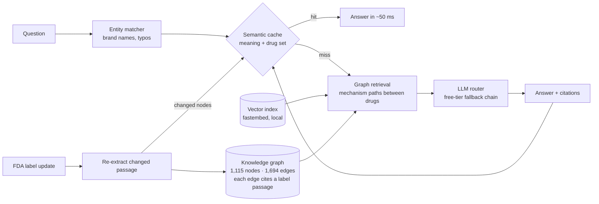

# MedGraph-RAG

GraphRAG over real FDA drug labels, with a **graph-aware semantic cache**.

> Educational demo — not medical advice.

## Why
Vector RAG retrieves text chunks that *look* similar to the question. Drug interactions are often
**multi-hop**: clarithromycin *inhibits* CYP3A4, simvastatin is *metabolized by* CYP3A4, so the
combination raises the risk of muscle damage. Those facts sit in different labels. A knowledge graph connects them.

GraphRAG answers cost seconds and an LLM call each. A semantic cache answers reworded questions in
milliseconds — but an ordinary semantic cache is dangerous in medicine: "warfarin + aspirin" and
"warfarin + naproxen" look almost identical to an embedding model.

## What's new here
1. **Entity-keyed semantic cache.** A hit needs a similar meaning *and* exactly the same set of drugs
   (recognized deterministically — brand names like "Zocor"/"Biaxin" and typos included, no LLM call).
2. **Provenance-scoped invalidation.** Every graph edge cites the label passage it came from, and every cached
   answer remembers which graph nodes it used. When a label changes, only the answers that depend on the changed
   facts are evicted.
3. **Mechanism-only graph paths.** A path between two drugs is used only if everything in between is a mechanism
   (shared enzyme, drug class or side effect) — "A interacts with X, X interacts with B" is noise, not evidence.
4. **Runs entirely on free LLM tiers.** Per-task model chains with automatic fallback, backoff, and skipping of
   models whose daily quota is exhausted; every call is cached on disk so the demo works offline.

## Architecture


| Stage | Tech |
|---|---|
| Corpus | 30 openFDA drug labels → 1,182 cited chunks |
| Graph extraction (offline) | `nvidia/nemotron-3-ultra-550b-a55b:free` (OpenRouter) → Nemotron Super → Gemini fallbacks |
| Answers (live) | `gemini-3.8-flash` → `3.6-flash` → `3.5-flash-lite` → `3.5-flash` → `3.7-flash` → Qwen 3.8 27B free → `openrouter/free` |
| Embeddings | `BAAI/bge-small-en-v1.5` via fastembed (CPU, local) |
| Graph / UI | NetworkX, pyvis, Streamlit |

## Results (20 questions on real FDA labels, 20 rewordings, 5 wrong-drug traps)

| Pipeline | Accuracy | Multi-hop | Single-hop | Contraindication |
|---|---|---|---|---|
| Vanilla RAG | 90% | 90% | 83% | 100% |
| **GraphRAG** | **95%** | **95%** | **100%** | 88% |
| GraphRAG + semantic cache (reworded questions) | 100% | 100% | 100% | 100% |

**Semantic cache**
- Reworded questions served from cache: **18/20**, in **~50 ms** (vs 2–30 s for an LLM answer on free tiers)
- Accuracy of the answers served from cache: **100%**
- Wrong-drug trap questions answered with another drug's answer: **0/5**

**Why the entity key matters** (offline sweep, no LLM calls):

| Similarity threshold | Correct hits | Wrong-drug hits **without** key | Wrong-drug hits **with** key |
|---|---|---|---|
| 0.80 | 19/20 | **5** | **0** |
| 0.85 (used) | 18/20 | 3 | 0 |
| 0.90 | 15/20 | 0 | 0 |

A plain semantic cache has to stay at 0.90 to be safe; the drug-set key allows 0.85 with more hits and still zero
wrong-drug answers.

**Label-update demo:** after the demo script below, a simulated warfarin label update (new metronidazole
interaction) evicted exactly the 5 cached answers involving warfarin and kept all 16 other answers in the cache.

**How to read these numbers honestly**
- Accuracy is graded by an LLM judge against reference answers written from the labels. A manual review of 10
  answers agreed 8/10 times; both disagreements were the judge being too strict on GraphRAG
  ([eval/spot_check.md](eval/spot_check.md)). The judge is not fully deterministic (±5 points between runs), so
  GraphRAG vs vanilla is "slightly ahead", not a decisive win; the clearer gains are in multi-hop/single-hop
  interaction questions and in explainability (every answer shows its graph path and cited passages).
- LLM latency depends on which free model has quota at the moment (2–6 s on fast Gemini models, up to ~30 s on
  fallbacks). Cache-hit latency is measured live.
- Full tables: [eval/results.md](eval/results.md).

## Run it
```
uv sync
uv run streamlit run app.py        # demo — works offline with the committed data + pre-warmed cache
uv run pytest                      # 76 unit tests (live tests excluded)
uv run pytest -m live -s           # live: router round-trip, embedder, headless 5-step app walkthrough
uv run python -m eval.run_eval     # benchmark (replays from data/llm_cache; new calls only for new prompts)
```
Rebuild the data from scratch: `python -m medgraph.ingest` → `python -m medgraph.extract` → `python -m medgraph.embeddings`
(needs `GEMINI_API_KEY` and/or `OPENROUTER_API_KEY`; on Windows, keys set with `setx` are also read from the registry).

## Demo script (≈4 min)
1. **Compare mode:** "Can a patient taking simvastatin start clarithromycin?" → both answer; GraphRAG shows the
   `clarithromycin → CYP3A4 ← simvastatin` path with citations from both labels.
2. **GraphRAG + cache:** "Is it safe to take Biaxin while on Zocor?" → ⚡ cache hit in ~50 ms, 0 LLM calls,
   "reused the answer to …".
3. "Can a patient taking warfarin also take aspirin?" (hit), then "…also take naproxen?" → **not** served the
   aspirin answer (different drug set).
4. Sidebar → **Apply update** (warfarin) → the 5 cached warfarin answers are evicted, the 16 others kept.

All four steps replay from disk, so they work even if every free LLM quota is exhausted. New, unscripted questions
need live quota (Gemini free-tier limits reset at midnight Pacific time).

## Limitations
- 30 drugs; an LLM-extracted graph can miss or mis-state facts (every edge links to its evidence text).
  Example: no direct sildenafil–nitroglycerin edge was extracted; the answer still comes from the label passages.
- Some labels are older formats (e.g. metformin uses serum-creatinine cut-offs, not eGFR).
- The label updates in the demo are simulated.
