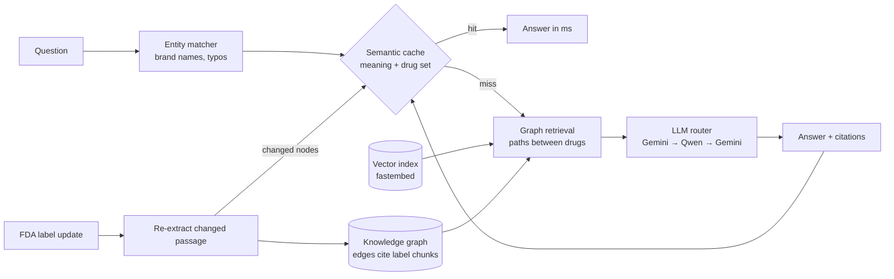

# MedGraph-RAG Implementation Plan

> **For agentic workers:** REQUIRED SUB-SKILL: Use superpowers:subagent-driven-development (recommended) or superpowers:executing-plans to implement this plan task-by-task. Steps use checkbox (`- [ ]`) syntax for tracking.

**Goal:** A GraphRAG system over real FDA drug labels with a graph-aware semantic cache, shown in a Streamlit demo and backed by a benchmark, ready for a college competition on 2026-09-26.

**Architecture:** openFDA labels are chunked and turned into a NetworkX knowledge graph by LLM extraction; every edge keeps its source chunk id. Questions are answered by three pipelines (vanilla vector RAG, GraphRAG path retrieval, GraphRAG + semantic cache) behind one `Engine`. The cache key is (canonicalized query embedding, exact drug set); cached answers remember their graph nodes so a label update evicts only dependent answers.

**Tech Stack:** Python 3.12 (uv), httpx, networkx, numpy, fastembed (BAAI/bge-small-en-v1.5, CPU), Streamlit, pyvis, pytest. LLMs: Gemini `gemini-3.8-flash` → OpenRouter `qwen/qwen3.8-27b:free` → Gemini `gemini-3.5-flash`.

**Spec:** `docs/superpowers/specs/2026-09-25-medgraph-rag-design.md`

## Global Constraints

- Python `>=3.12,<3.13` via `uv` (system Python 3.14 lacks wheels for some deps). Run everything with `uv run`.
- Provider chain, in order: `("gemini","gemini-3.8-flash")`, `("openrouter","qwen/qwen3.8-27b:free")`, `("gemini","gemini-3.5-flash")`.
- Gemini `answer` task uses `thinkingConfig.thinkingLevel = "low"`; `"minimal"` is rejected by the API. OpenRouter `answer` task sends `"reasoning": {"enabled": false}`.
- Keys come from env vars `GEMINI_API_KEY` / `OPENROUTER_API_KEY`, falling back to `HKCU\Environment` in the Windows registry. Never log, print, or commit keys; Gemini key goes in the `x-goog-api-key` header, never the URL.
- Every LLM call goes through `medgraph.llm_router.Router` (disk cache + fallback). No other module talks to an LLM API.
- OpenRouter free quota is 50 requests/day on this account — tests never hit the network (live tests are marked `@pytest.mark.live` and excluded by default).
- Query entity extraction is deterministic code — no LLM call.
- Cache hit requires exact `drug_key` match AND cosine ≥ threshold (default 0.90, tuned in Task 10).
- UI always shows: "Educational demo — not medical advice."
- Generated artifacts in `data/` are committed (demo must run offline); `data/models/` and `.venv/` are not.

## Review Focus

1. **Brand names and typos in questions** ("Coumadin", "simvastatine") → must map to the generic drug for both retrieval and the cache key. Tests: Task 6 `test_brand_names_map_to_generic`, `test_typo_tolerance`.
2. **A question with no recognizable drug** → GraphRAG must fall back to vector seeds and still answer, not crash on an empty graph query. Test: Task 8 `test_graphrag_without_entities_falls_back`.
3. **All LLM providers rate-limited mid-demo** → the error surfaces as `LLMError`, nothing half-written is cached, and the app shows a message instead of a traceback. Tests: Task 1 `test_all_fail_raises`, Task 8 `test_llm_failure_not_cached`; app handling in Task 9.
4. **LLM returns malformed JSON, invented chunk ids or unknown relation types during extraction** → bad items are dropped, a repair retry happens once, and the graph build continues. Tests: Task 4 `test_parse_drops_invalid_items`, `test_extract_drug_repairs_bad_json`.
5. **Same wording, different drug ("warfarin + aspirin" vs "warfarin + ibuprofen")** → must never be a cache hit. Tests: Task 7 `test_different_entity_key_never_hits`, Task 8 `test_cached_blocks_different_drug`, Task 10 trap measurement.

---

## File Structure

```
pyproject.toml, .python-version, .gitignore
medgraph/
  __init__.py
  config.py          # paths, drug list, models, thresholds
  llm_router.py      # Router (disk cache + provider fallback), parse_json_object
  aliases.py         # brand→generic map, name/text normalization
  ingest.py          # openFDA fetch, section cleanup, chunking, chunk IO
  graph_store.py     # GraphStore (NetworkX MultiDiGraph + provenance), CLI inspector
  extract.py         # extraction prompt, parser, extract_drug, graph build CLI
  embeddings.py      # Embedder (fastembed), VectorIndex, index build CLI
  entities.py        # match_entities, drug_key, canonicalize
  semantic_cache.py  # SemanticCache, CacheEntry
  pipelines.py       # Answer, Engine (vanilla/graphrag/cached/update_label), load_engine
  ask.py             # CLI: ask one question
  metrics.py         # session metrics
  viz.py             # pyvis subgraph HTML
app.py               # Streamlit UI
data/demo_updates.json
eval/__init__.py, eval/questions.json, eval/check_questions.py, eval/run_eval.py
tests/conftest.py + one test file per module
README.md, docs/slides.md
```

---

### Task 1: Project setup + config + LLM router

**Files:**
- Create: `pyproject.toml`, `.gitignore`, `medgraph/__init__.py`, `medgraph/config.py`, `medgraph/llm_router.py`
- Test: `tests/conftest.py`, `tests/test_llm_router.py`, `tests/test_live.py`

**Interfaces:**
- Produces:
  - `config.*` constants (below).
  - `LLMResult(text: str, provider: str, model: str, cached: bool, latency_ms: float, gen_latency_ms: float)`
  - `class LLMError(RuntimeError)`
  - `Router(providers=None, cache_dir=None, transport=None, retry_pause_s=5.0)`; `.complete(prompt: str, task: str = "answer", json_mode: bool = False) -> LLMResult`; attributes `calls: int`, `cache_hits: int`, `by_provider: dict[str, int]`, `errors: list[str]`
  - `get_key(name: str) -> str | None`
  - `parse_json_object(text: str) -> dict` (raises `ValueError`)
  - Test doubles in `tests/conftest.py`: `FakeRouter`, `FakeEmbedder`

- [ ] **Step 1: Create project files**

`pyproject.toml`:
```toml
[project]
name = "medgraph"
version = "0.1.0"
description = "GraphRAG over FDA drug labels with a graph-aware semantic cache"
requires-python = ">=3.12,<3.13"
dependencies = [
    "httpx>=0.27",
    "networkx>=3.3",
    "numpy>=1.26",
    "fastembed>=0.4",
    "streamlit>=1.38",
    "pyvis>=0.3.2",
]

[dependency-groups]
dev = ["pytest>=8"]

[tool.pytest.ini_options]
testpaths = ["tests"]
pythonpath = ["."]
markers = ["live: calls real network APIs (spends quota)"]
addopts = "-m 'not live'"
```

`.gitignore`:
```
.venv/
__pycache__/
.pytest_cache/
data/models/
*.pyc
.env
```

`medgraph/__init__.py`: empty file.

`medgraph/config.py`:
```python
"""Project-wide settings: paths, corpus, models, retrieval and cache knobs."""
from pathlib import Path

ROOT = Path(__file__).resolve().parent.parent
DATA = ROOT / "data"
RAW_DIR = DATA / "raw"
CHUNKS_PATH = DATA / "chunks.jsonl"
GRAPH_PATH = DATA / "graph.json"
EMB_PATH = DATA / "embeddings.npy"
EMB_IDS_PATH = DATA / "embedding_ids.json"
LLM_CACHE_DIR = DATA / "llm_cache"
CACHE_PATH = DATA / "cache.json"
MODEL_DIR = DATA / "models"
DEMO_UPDATES_PATH = DATA / "demo_updates.json"

OPENFDA_URL = "https://api.fda.gov/drug/label.json"
GEMINI_URL = "https://generativelanguage.googleapis.com/v1beta/models"
OPENROUTER_URL = "https://openrouter.ai/api/v1/chat/completions"

DRUGS = [
    "warfarin", "aspirin", "ibuprofen", "naproxen", "clopidogrel", "simvastatin",
    "atorvastatin", "clarithromycin", "erythromycin", "ketoconazole", "fluconazole",
    "sertraline", "fluoxetine", "tramadol", "metformin", "lisinopril", "spironolactone",
    "digoxin", "amiodarone", "omeprazole", "rifampin", "carbamazepine", "lithium",
    "methotrexate", "allopurinol", "sildenafil", "nitroglycerin", "levothyroxine",
    "prednisone", "acetaminophen",
]
SECTIONS = [
    "boxed_warning", "contraindications", "drug_interactions", "warnings_and_cautions",
    "warnings", "clinical_pharmacology", "do_not_use", "ask_doctor_or_pharmacist",
]
SECTION_CHAR_CAP = 15000
CHUNK_SIZE = 800
CHUNK_OVERLAP = 100

# (provider, model) in fallback order
PROVIDERS = [
    ("gemini", "gemini-3.8-flash"),
    ("openrouter", "qwen/qwen3.8-27b:free"),
    ("gemini", "gemini-3.5-flash"),
]
TIMEOUTS = {"answer": 60.0, "extract": 240.0}

EMBED_MODEL = "BAAI/bge-small-en-v1.5"

TOP_K = 6
MAX_PATH_LEN = 3
MAX_PATHS = 8
NEIGHBOR_EDGE_LIMIT = 30
MAX_FACTS = 40
MAX_CONTEXT_CHUNKS = 8

CACHE_THRESHOLD = 0.90
REF_USD_PER_CALL = 0.01  # illustrative paid-model price per answer call, for "$ saved"
```

- [ ] **Step 2: Install the environment**

Run:
```
uv python pin 3.12
uv sync
```
Expected: `.venv` created with Python 3.12, all packages installed without errors.

- [ ] **Step 3: Write test doubles and failing router tests**

`tests/conftest.py`:
```python
import hashlib
import re

import numpy as np

from medgraph.llm_router import LLMResult


class FakeRouter:
    """Stands in for Router: returns queued replies (or a default), records prompts."""

    def __init__(self, replies=None, default="ok"):
        self.replies = list(replies or [])
        self.default = default
        self.prompts: list[tuple[str, str]] = []
        self.by_provider: dict[str, int] = {}

    def complete(self, prompt, task="answer", json_mode=False):
        self.prompts.append((task, prompt))
        reply = self.replies.pop(0) if self.replies else self.default
        if isinstance(reply, Exception):
            raise reply
        return LLMResult(text=reply, provider="fake", model="fake-1", cached=False,
                         latency_ms=5.0, gen_latency_ms=5.0)


class FakeEmbedder:
    """Deterministic bag-of-words hashing embedder (unit-normalized)."""

    dim = 64

    def _vec(self, text):
        v = np.zeros(self.dim, dtype=np.float32)
        for w in re.findall(r"[a-z0-9]+", text.lower()):
            v[int(hashlib.md5(w.encode()).hexdigest(), 16) % self.dim] += 1.0
        n = np.linalg.norm(v)
        return v / n if n else v

    def embed_query(self, text):
        return self._vec(text)

    def embed_docs(self, texts):
        return np.stack([self._vec(t) for t in texts])
```

`tests/test_llm_router.py`:
```python
import pytest

from medgraph.llm_router import LLMError, Router, parse_json_object

PROV = [("gemini", "g1"), ("openrouter", "q1"), ("gemini", "g2")]


def make(transport, tmp_path):
    return Router(providers=PROV, cache_dir=tmp_path, transport=transport, retry_pause_s=0)


def test_primary_success(tmp_path):
    seen = []

    def t(provider, model, prompt, task, json_mode):
        seen.append(model)
        return "hi"

    r = make(t, tmp_path).complete("q")
    assert (r.text, r.provider, r.model, r.cached) == ("hi", "gemini", "g1", False)
    assert seen == ["g1"]


def test_falls_back_on_error_and_empty_output(tmp_path):
    def t(provider, model, prompt, task, json_mode):
        if model == "g1":
            raise RuntimeError("429 Too Many Requests")
        if model == "q1":
            return "   "
        return "ok"

    router = make(t, tmp_path)
    r = router.complete("q")
    assert r.model == "g2"
    assert router.by_provider == {"gemini/g2": 1}
    assert len(router.errors) == 2


def test_disk_cache_hit_skips_transport(tmp_path):
    n = [0]

    def t(*args):
        n[0] += 1
        return "x"

    router = make(t, tmp_path)
    first = router.complete("q")
    second = router.complete("q")
    assert second.cached and second.text == "x"
    assert second.gen_latency_ms == pytest.approx(first.gen_latency_ms)
    assert n[0] == 1 and router.cache_hits == 1 and router.calls == 1


def test_cache_key_depends_on_task_and_json_mode(tmp_path):
    n = [0]

    def t(*args):
        n[0] += 1
        return "{}"

    router = make(t, tmp_path)
    router.complete("q", task="answer")
    router.complete("q", task="extract")
    router.complete("q", task="extract", json_mode=True)
    assert n[0] == 3


def test_all_fail_raises(tmp_path):
    def t(*args):
        raise RuntimeError("down")

    with pytest.raises(LLMError):
        make(t, tmp_path).complete("q")


def test_parse_json_object_strips_fences_and_prose():
    assert parse_json_object('```json\n{"a": 1}\n```') == {"a": 1}
    assert parse_json_object('Here you go: {"a": [1, 2]} thanks') == {"a": [1, 2]}
    with pytest.raises(ValueError):
        parse_json_object("no json here")
```

`tests/test_live.py`:
```python
import pytest

from medgraph.llm_router import Router


@pytest.mark.live
def test_router_live_roundtrip(tmp_path):
    r = Router(cache_dir=tmp_path).complete("Reply with exactly: OK")
    assert "OK" in r.text.upper()
    print(r.provider, r.model, round(r.latency_ms))
```

- [ ] **Step 4: Run tests to verify they fail**

Run: `uv run pytest tests/test_llm_router.py -v`
Expected: FAIL — `ModuleNotFoundError: No module named 'medgraph.llm_router'`

- [ ] **Step 5: Implement the router**

`medgraph/llm_router.py`:
```python
"""Single entry point for every LLM call: disk cache + provider fallback chain."""
from __future__ import annotations

import hashlib
import json
import os
import re
import time
from dataclasses import dataclass
from pathlib import Path
from typing import Callable

import httpx

from medgraph import config


class LLMError(RuntimeError):
    """Every provider in the chain failed."""


@dataclass
class LLMResult:
    text: str
    provider: str
    model: str
    cached: bool
    latency_ms: float      # wall time of this call (tiny when served from disk)
    gen_latency_ms: float  # time the original generation took (for honest benchmarks)


# (provider, model, prompt, task, json_mode) -> text
Transport = Callable[[str, str, str, str, bool], str]


def get_key(name: str) -> str | None:
    """Env var first; then the Windows user environment (setx doesn't update open shells)."""
    val = os.environ.get(name)
    if val:
        return val
    try:
        import winreg

        with winreg.OpenKey(winreg.HKEY_CURRENT_USER, "Environment") as k:
            return winreg.QueryValueEx(k, name)[0]
    except (ImportError, OSError):
        return None


def _gemini(model: str, prompt: str, task: str, json_mode: bool) -> str:
    key = get_key("GEMINI_API_KEY")
    if not key:
        raise RuntimeError("GEMINI_API_KEY not set")
    gen: dict = {}
    if json_mode:
        gen["responseMimeType"] = "application/json"
    if task == "answer":
        gen["thinkingConfig"] = {"thinkingLevel": "low"}
    body = {"contents": [{"parts": [{"text": prompt}]}], "generationConfig": gen}
    r = httpx.post(f"{config.GEMINI_URL}/{model}:generateContent",
                   headers={"x-goog-api-key": key}, json=body, timeout=config.TIMEOUTS[task])
    r.raise_for_status()
    parts = r.json()["candidates"][0]["content"].get("parts", [])
    return "".join(p.get("text", "") for p in parts if not p.get("thought"))


def _openrouter(model: str, prompt: str, task: str, json_mode: bool) -> str:
    key = get_key("OPENROUTER_API_KEY")
    if not key:
        raise RuntimeError("OPENROUTER_API_KEY not set")
    body: dict = {"model": model, "messages": [{"role": "user", "content": prompt}]}
    if task == "answer":
        body["reasoning"] = {"enabled": False}
    r = httpx.post(config.OPENROUTER_URL, headers={"Authorization": f"Bearer {key}"},
                   json=body, timeout=config.TIMEOUTS[task])
    r.raise_for_status()
    return r.json()["choices"][0]["message"].get("content") or ""


def default_transport(provider: str, model: str, prompt: str, task: str, json_mode: bool) -> str:
    fn = {"gemini": _gemini, "openrouter": _openrouter}[provider]
    return fn(model, prompt, task, json_mode)


class Router:
    def __init__(self, providers=None, cache_dir: Path | None = None,
                 transport: Transport | None = None, retry_pause_s: float = 5.0):
        self.providers = providers or config.PROVIDERS
        self.cache_dir = Path(cache_dir or config.LLM_CACHE_DIR)
        self.cache_dir.mkdir(parents=True, exist_ok=True)
        self.transport = transport or default_transport
        self.retry_pause_s = retry_pause_s
        self.calls = 0
        self.cache_hits = 0
        self.by_provider: dict[str, int] = {}
        self.errors: list[str] = []

    def _path(self, prompt: str, task: str, json_mode: bool) -> Path:
        digest = hashlib.sha256(f"{task}|{json_mode}|{prompt}".encode("utf-8")).hexdigest()
        return self.cache_dir / f"{digest}.json"

    def complete(self, prompt: str, task: str = "answer", json_mode: bool = False) -> LLMResult:
        path = self._path(prompt, task, json_mode)
        t0 = time.perf_counter()
        if path.exists():
            d = json.loads(path.read_text(encoding="utf-8"))
            self.cache_hits += 1
            return LLMResult(d["text"], d["provider"], d["model"], True,
                             (time.perf_counter() - t0) * 1000, d.get("gen_latency_ms", 0.0))
        for attempt in range(2):
            for provider, model in self.providers:
                t_call = time.perf_counter()
                try:
                    text = self.transport(provider, model, prompt, task, json_mode)
                except Exception as e:  # any provider failure → next in chain
                    self.errors.append(f"{provider}/{model}: {type(e).__name__}: {e}"[:300])
                    continue
                if not text or not text.strip():
                    self.errors.append(f"{provider}/{model}: empty output")
                    continue
                gen_ms = (time.perf_counter() - t_call) * 1000
                self.calls += 1
                label = f"{provider}/{model}"
                self.by_provider[label] = self.by_provider.get(label, 0) + 1
                path.write_text(json.dumps({"text": text, "provider": provider, "model": model,
                                            "gen_latency_ms": gen_ms}), encoding="utf-8")
                return LLMResult(text, provider, model, False,
                                 (time.perf_counter() - t0) * 1000, gen_ms)
            if attempt == 0:
                time.sleep(self.retry_pause_s)
        raise LLMError("all providers failed: " + " | ".join(self.errors[-len(self.providers):]))


_FENCE = re.compile(r"^```(?:json)?\s*|\s*```$", re.MULTILINE)


def parse_json_object(text: str) -> dict:
    """Extract the outermost JSON object from an LLM reply (tolerates fences and prose)."""
    cleaned = _FENCE.sub("", text.strip())
    start, end = cleaned.find("{"), cleaned.rfind("}")
    if start == -1 or end <= start:
        raise ValueError("no JSON object found")
    try:
        return json.loads(cleaned[start:end + 1])
    except json.JSONDecodeError as e:
        raise ValueError(f"invalid JSON: {e}") from e
```

- [ ] **Step 6: Run tests to verify they pass**

Run: `uv run pytest tests/test_llm_router.py -v`
Expected: 6 passed.

- [ ] **Step 7: Live smoke test (1 real call)**

Run: `uv run pytest tests/test_live.py -m live -s -v`
Expected: PASS, prints e.g. `gemini gemini-3.8-flash 6000`. If Gemini fails, the printout shows which fallback served it. The test uses `tmp_path`, so this call is not stored in `data/llm_cache`.

- [ ] **Step 8: Commit**

```bash
git add pyproject.toml uv.lock .python-version .gitignore medgraph tests
git commit -m "feat: project setup and LLM router with disk cache and provider fallback"
```

---

### Task 2: Ingest openFDA labels into chunks

**Files:**
- Create: `medgraph/ingest.py`
- Test: `tests/test_ingest.py`

**Interfaces:**
- Consumes: `config.DRUGS`, `config.SECTIONS`, `config.SECTION_CHAR_CAP`, `config.CHUNK_SIZE`, `config.CHUNK_OVERLAP`, `config.RAW_DIR`, `config.CHUNKS_PATH`
- Produces:
  - Chunk dict shape: `{"id": "<drug>:<section>:<i>", "drug": str, "section": str, "text": str}`
  - `chunk_text(text: str, size: int = config.CHUNK_SIZE, overlap: int = config.CHUNK_OVERLAP) -> list[str]`
  - `label_sections(label: dict) -> dict[str, str]`
  - `build_chunks(drug: str, label: dict) -> list[dict]`
  - `pick_label(drug: str, results: list[dict]) -> dict | None`
  - `load_chunks(path=config.CHUNKS_PATH) -> dict[str, dict]` (id → chunk)
  - `save_chunks(chunks: list[dict], path=config.CHUNKS_PATH) -> None`
  - CLI: `uv run python -m medgraph.ingest`

- [ ] **Step 1: Write the failing tests**

`tests/test_ingest.py`:
```python
from medgraph.ingest import build_chunks, chunk_text, label_sections, load_chunks, pick_label, save_chunks


def test_chunk_text_short_text_is_one_chunk():
    assert chunk_text("hello   world", size=50, overlap=10) == ["hello world"]
    assert chunk_text("", size=50, overlap=10) == []


def test_chunk_text_respects_size_and_overlaps():
    text = " ".join(f"word{i}" for i in range(200))
    chunks = chunk_text(text, size=100, overlap=20)
    assert len(chunks) > 5
    assert all(len(c) <= 100 for c in chunks)
    # consecutive chunks share some text (overlap)
    assert chunks[0][-10:].split()[-1] in chunks[1]
    # nothing lost at the end
    assert chunks[-1].endswith("word199")


def test_label_sections_cleans_and_caps():
    label = {"drug_interactions": ["7 DRUG   INTERACTIONS\n x" + "a" * 20000],
             "contraindications": ["None."], "unrelated": ["zzz"]}
    secs = label_sections(label)
    assert set(secs) == {"drug_interactions", "contraindications"}
    assert "  " not in secs["drug_interactions"]
    assert len(secs["drug_interactions"]) <= 15000


def test_build_chunks_ids_and_fields():
    label = {"drug_interactions": ["Clarithromycin increases exposure. " * 40],
             "contraindications": ["Pregnancy."]}
    chunks = build_chunks("simvastatin", label)
    ids = [c["id"] for c in chunks]
    assert ids[0] == "simvastatin:contraindications:0"
    assert "simvastatin:drug_interactions:0" in ids and "simvastatin:drug_interactions:1" in ids
    assert all(c["drug"] == "simvastatin" and c["text"] for c in chunks)


def test_pick_label_prefers_single_ingredient_with_interactions():
    combo = {"openfda": {"generic_name": ["ASPIRIN AND DIPYRIDAMOLE"]},
             "drug_interactions": ["x" * 9000]}
    otc = {"openfda": {"generic_name": ["ASPIRIN"]}, "warnings": ["y" * 3000]}
    rx = {"openfda": {"generic_name": ["ASPIRIN"]}, "drug_interactions": ["z" * 2000]}
    assert pick_label("aspirin", [combo, otc, rx]) is rx
    assert pick_label("aspirin", []) is None


def test_chunks_roundtrip(tmp_path):
    p = tmp_path / "c.jsonl"
    chunks = [{"id": "a:b:0", "drug": "a", "section": "b", "text": "t"}]
    save_chunks(chunks, p)
    assert load_chunks(p) == {"a:b:0": chunks[0]}
```

- [ ] **Step 2: Run tests to verify they fail**

Run: `uv run pytest tests/test_ingest.py -v`
Expected: FAIL — `ModuleNotFoundError: No module named 'medgraph.ingest'`

- [ ] **Step 3: Implement ingest**

`medgraph/ingest.py`:
```python
"""Fetch FDA drug labels from openFDA and split them into citable chunks."""
from __future__ import annotations

import json
from pathlib import Path

import httpx

from medgraph import config


def chunk_text(text: str, size: int = config.CHUNK_SIZE, overlap: int = config.CHUNK_OVERLAP) -> list[str]:
    text = " ".join(text.split())
    if not text:
        return []
    if len(text) <= size:
        return [text]
    chunks, start = [], 0
    while start < len(text):
        end = min(start + size, len(text))
        if end < len(text):
            space = text.rfind(" ", start + size // 2, end)
            if space != -1:
                end = space
        chunks.append(text[start:end].strip())
        if end >= len(text):
            break
        start = max(end - overlap, start + 1)
    return [c for c in chunks if c]


def label_sections(label: dict) -> dict[str, str]:
    out = {}
    for section in config.SECTIONS:
        values = label.get(section)
        if not values:
            continue
        text = " ".join(" ".join(values).split())[: config.SECTION_CHAR_CAP]
        if text:
            out[section] = text
    return out


def build_chunks(drug: str, label: dict) -> list[dict]:
    chunks = []
    for section, text in label_sections(label).items():
        for i, piece in enumerate(chunk_text(text)):
            chunks.append({"id": f"{drug}:{section}:{i}", "drug": drug, "section": section, "text": piece})
    return chunks


def _score(drug: str, label: dict) -> tuple[bool, bool, int]:
    names = [n.lower() for n in label.get("openfda", {}).get("generic_name", [])]
    single = len(names) == 1 and drug in names[0] and " and " not in names[0] and "," not in names[0]
    has_interactions = bool(label.get("drug_interactions"))
    size = sum(len(" ".join(label.get(s, []))) for s in config.SECTIONS)
    return (single, has_interactions, size)


def pick_label(drug: str, results: list[dict]) -> dict | None:
    if not results:
        return None
    return max(results, key=lambda lbl: _score(drug, lbl))


def fetch_label(drug: str) -> dict | None:
    params = {"search": f'openfda.generic_name:"{drug}"', "limit": 20}
    try:
        r = httpx.get(config.OPENFDA_URL, params=params, timeout=30)
    except httpx.HTTPError:
        return None
    if r.status_code != 200:
        return None
    return pick_label(drug, r.json().get("results", []))


def save_chunks(chunks: list[dict], path: Path = config.CHUNKS_PATH) -> None:
    Path(path).parent.mkdir(parents=True, exist_ok=True)
    with open(path, "w", encoding="utf-8") as f:
        for c in chunks:
            f.write(json.dumps(c, ensure_ascii=False) + "\n")


def load_chunks(path: Path = config.CHUNKS_PATH) -> dict[str, dict]:
    out = {}
    with open(path, encoding="utf-8") as f:
        for line in f:
            if line.strip():
                c = json.loads(line)
                out[c["id"]] = c
    return out


def main() -> None:
    config.RAW_DIR.mkdir(parents=True, exist_ok=True)
    all_chunks: list[dict] = []
    for drug in config.DRUGS:
        label = fetch_label(drug)
        if label is None:
            print(f"SKIP {drug}: no label found")
            continue
        (config.RAW_DIR / f"{drug}.json").write_text(json.dumps(label), encoding="utf-8")
        chunks = build_chunks(drug, label)
        all_chunks.extend(chunks)
        print(f"{drug:15s} {len(chunks):3d} chunks  sections={sorted({c['section'] for c in chunks})}")
    save_chunks(all_chunks)
    print(f"TOTAL {len(all_chunks)} chunks from {len({c['drug'] for c in all_chunks})} drugs")


if __name__ == "__main__":
    main()
```

- [ ] **Step 4: Run tests to verify they pass**

Run: `uv run pytest tests/test_ingest.py -v`
Expected: 6 passed.

- [ ] **Step 5: Fetch the real corpus**

Run: `uv run python -m medgraph.ingest`
Expected: one line per drug, then `TOTAL <~800-1200> chunks from <28-30> drugs`. openFDA allows 240 requests/min without a key, so 30 requests are fine.

Verify that the core demo facts are in the text:
```
uv run python -c "from medgraph.ingest import load_chunks; c=load_chunks(); t=' '.join(x['text'].lower() for x in c.values() if x['drug']=='simvastatin'); print('clarithromycin' in t, 'cyp3a4' in t.replace(' ',''), 'myopathy' in t)"
```
Expected: `True True True`

- [ ] **Step 6: Commit**

```bash
git add medgraph/ingest.py tests/test_ingest.py data/raw data/chunks.jsonl
git commit -m "feat: ingest openFDA drug labels into citable chunks"
```

---

### Task 3: Graph store with provenance

**Files:**
- Create: `medgraph/graph_store.py`
- Test: `tests/test_graph_store.py`

**Interfaces:**
- Consumes: `config.MAX_PATH_LEN`, `config.MAX_PATHS`, `config.GRAPH_PATH`
- Produces:
  - Entity dict: `{"name": str, "type": str}`; relation dict: `{"source": str, "target": str, "type": str, "chunk_id": str, "evidence": str}`
  - Edge dict returned by queries: `{"source", "target", "type", "chunk_id", "drug", "evidence"}`
  - `GraphStore()` with: `.g` (nx.MultiDiGraph), `.version: int`, `add_entity(name, type_)`, `add_relation(source, target, type_, chunk_id, drug, evidence="")`, `add_extraction(drug, entities, relations)`, `replace_chunks(drug, chunk_ids: set[str], entities, relations) -> set[str]`, `node_types() -> dict[str, str]`, `paths_between(a, b, max_len=config.MAX_PATH_LEN) -> list[list[str]]`, `edges_between(u, v) -> list[dict]`, `neighborhood_edges(nodes, limit) -> list[dict]`, `save(path=config.GRAPH_PATH)`, `GraphStore.load(path=config.GRAPH_PATH) -> GraphStore`, `stats() -> dict`
  - CLI: `uv run python -m medgraph.graph_store <drugA> <drugB>` prints paths

- [ ] **Step 1: Write the failing tests**

`tests/test_graph_store.py`:
```python
from medgraph.graph_store import GraphStore


def sample() -> GraphStore:
    g = GraphStore()
    g.add_extraction("simvastatin", [{"name": "cyp3a4", "type": "Enzyme"}], [
        {"source": "simvastatin", "target": "cyp3a4", "type": "METABOLIZED_BY",
         "chunk_id": "simvastatin:clinical_pharmacology:0", "evidence": "metabolized by CYP3A4"}])
    g.add_extraction("clarithromycin", [{"name": "cyp3a4", "type": "Enzyme"}], [
        {"source": "clarithromycin", "target": "cyp3a4", "type": "INHIBITS",
         "chunk_id": "clarithromycin:drug_interactions:0", "evidence": "strong CYP3A4 inhibitor"}])
    return g


def test_types_and_drug_node():
    g = sample()
    t = g.node_types()
    assert t["simvastatin"] == "Drug" and t["cyp3a4"] == "Enzyme"


def test_paths_ignore_edge_direction():
    g = sample()
    assert g.paths_between("simvastatin", "clarithromycin") == [["simvastatin", "cyp3a4", "clarithromycin"]]
    assert g.paths_between("simvastatin", "nonexistent") == []


def test_edges_between_both_directions():
    g = sample()
    edges = g.edges_between("cyp3a4", "clarithromycin")
    assert len(edges) == 1
    assert edges[0]["source"] == "clarithromycin" and edges[0]["type"] == "INHIBITS"
    assert edges[0]["drug"] == "clarithromycin"


def test_neighborhood_edges_limit_and_priority():
    g = sample()
    g.add_relation("simvastatin", "headache", "CAUSES", "simvastatin:warnings:0", "simvastatin")
    edges = g.neighborhood_edges(["simvastatin"], limit=1)
    assert len(edges) == 1 and edges[0]["type"] == "METABOLIZED_BY"


def test_replace_chunks_reports_changed_nodes_and_drops_orphans():
    g = sample()
    g.add_relation("simvastatin", "headache", "CAUSES", "simvastatin:warnings:0", "simvastatin")
    v0 = g.version
    changed = g.replace_chunks("simvastatin", {"simvastatin:warnings:0"},
                               [{"name": "rhabdomyolysis", "type": "SideEffect"}],
                               [{"source": "simvastatin", "target": "rhabdomyolysis", "type": "CAUSES",
                                 "chunk_id": "simvastatin:warnings:0", "evidence": "rhabdo"}])
    assert changed == {"simvastatin", "headache", "rhabdomyolysis"}
    assert "headache" not in g.g  # orphan removed
    assert g.g.has_edge("simvastatin", "cyp3a4")  # untouched chunk kept
    assert g.version == v0 + 1  # one replace = one version bump (cached path search invalidates)


def test_save_load_roundtrip(tmp_path):
    g = sample()
    p = tmp_path / "g.json"
    g.save(p)
    h = GraphStore.load(p)
    assert h.node_types() == g.node_types()
    assert h.edges_between("simvastatin", "cyp3a4") == g.edges_between("simvastatin", "cyp3a4")
```

- [ ] **Step 2: Run tests to verify they fail**

Run: `uv run pytest tests/test_graph_store.py -v`
Expected: FAIL — `ModuleNotFoundError: No module named 'medgraph.graph_store'`

- [ ] **Step 3: Implement GraphStore**

`medgraph/graph_store.py`:
```python
"""Knowledge graph over drug-label facts; every edge keeps its source chunk (provenance)."""
from __future__ import annotations

import json
import sys
from itertools import islice
from pathlib import Path

import networkx as nx

from medgraph import config

# Edge types most useful as context, first
EDGE_PRIORITY = ["INTERACTS_WITH", "CONTRAINDICATED_IN", "INHIBITS", "INDUCES",
                 "METABOLIZED_BY", "BELONGS_TO", "CAUSES"]


class GraphStore:
    def __init__(self) -> None:
        self.g = nx.MultiDiGraph()
        self.version = 0
        self._und: nx.Graph | None = None
        self._und_version = -1

    # ---- building -------------------------------------------------------
    def add_entity(self, name: str, type_: str) -> None:
        if name not in self.g:
            self.g.add_node(name, type=type_)
        elif type_ == "Drug" or self.g.nodes[name].get("type") == "Unknown":
            self.g.nodes[name]["type"] = type_

    def add_relation(self, source: str, target: str, type_: str, chunk_id: str,
                     drug: str, evidence: str = "") -> None:
        for n in (source, target):
            if n not in self.g:
                self.g.add_node(n, type="Unknown")
        self.g.add_edge(source, target, key=f"{type_}|{chunk_id}", type=type_,
                        chunk_id=chunk_id, drug=drug, evidence=evidence)

    def add_extraction(self, drug: str, entities: list[dict], relations: list[dict]) -> None:
        self.add_entity(drug, "Drug")
        for e in entities:
            self.add_entity(e["name"], e["type"])
        for r in relations:
            self.add_relation(r["source"], r["target"], r["type"], r["chunk_id"], drug, r.get("evidence", ""))
        self.version += 1

    def _signature(self, chunk_ids: set[str]) -> set[tuple[str, str, str]]:
        return {(u, v, d["type"]) for u, v, d in self.g.edges(data=True) if d["chunk_id"] in chunk_ids}

    def replace_chunks(self, drug: str, chunk_ids: set[str], entities: list[dict],
                       relations: list[dict]) -> set[str]:
        """Swap the facts sourced from `chunk_ids`; return nodes whose facts changed (always incl. drug)."""
        before = self._signature(chunk_ids)
        stale = [(u, v, k) for u, v, k, d in self.g.edges(keys=True, data=True) if d["chunk_id"] in chunk_ids]
        self.g.remove_edges_from(stale)
        self.add_extraction(drug, entities, relations)
        self.version -= 1  # add_extraction bumped it; count the whole replace as one change
        after = self._signature(chunk_ids)
        changed = {drug}
        for u, v, _ in before ^ after:
            changed.update((u, v))
        self.g.remove_nodes_from([n for n in list(self.g.nodes) if self.g.degree(n) == 0 and n != drug])
        self.version += 1
        return changed

    # ---- querying -------------------------------------------------------
    def node_types(self) -> dict[str, str]:
        return {n: d.get("type", "Unknown") for n, d in self.g.nodes(data=True)}

    def _undirected(self) -> nx.Graph:
        if self._und is None or self._und_version != self.version:
            self._und = nx.Graph(self.g)
            self._und_version = self.version
        return self._und

    def paths_between(self, a: str, b: str, max_len: int = config.MAX_PATH_LEN) -> list[list[str]]:
        if a not in self.g or b not in self.g or a == b:
            return []
        und = self._undirected()
        if not nx.has_path(und, a, b):
            return []
        out = []
        for path in islice(nx.shortest_simple_paths(und, a, b), config.MAX_PATHS):
            if len(path) - 1 > max_len:
                break
            out.append(path)
        return out

    def edges_between(self, u: str, v: str) -> list[dict]:
        out = []
        for a, b in ((u, v), (v, u)):
            if self.g.has_edge(a, b):
                for d in self.g.get_edge_data(a, b).values():
                    out.append({"source": a, "target": b, **d})
        return out

    def neighborhood_edges(self, nodes: list[str], limit: int) -> list[dict]:
        edges = []
        for n in nodes:
            if n not in self.g:
                continue
            for u, v, d in list(self.g.out_edges(n, data=True)) + list(self.g.in_edges(n, data=True)):
                edges.append({"source": u, "target": v, **d})
        rank = {t: i for i, t in enumerate(EDGE_PRIORITY)}
        edges.sort(key=lambda e: rank.get(e["type"], len(rank)))
        return edges[:limit]

    def stats(self) -> dict:
        by_type: dict[str, int] = {}
        for _, t in self.node_types().items():
            by_type[t] = by_type.get(t, 0) + 1
        edge_types: dict[str, int] = {}
        for _, _, d in self.g.edges(data=True):
            edge_types[d["type"]] = edge_types.get(d["type"], 0) + 1
        return {"nodes": self.g.number_of_nodes(), "edges": self.g.number_of_edges(),
                "node_types": by_type, "edge_types": edge_types}

    # ---- persistence ----------------------------------------------------
    def save(self, path: Path = config.GRAPH_PATH) -> None:
        data = {
            "version": self.version,
            "nodes": [{"name": n, "type": d.get("type", "Unknown")} for n, d in self.g.nodes(data=True)],
            "edges": [{"source": u, "target": v, **d} for u, v, d in self.g.edges(data=True)],
        }
        Path(path).parent.mkdir(parents=True, exist_ok=True)
        Path(path).write_text(json.dumps(data, ensure_ascii=False, indent=1), encoding="utf-8")

    @classmethod
    def load(cls, path: Path = config.GRAPH_PATH) -> "GraphStore":
        data = json.loads(Path(path).read_text(encoding="utf-8"))
        gs = cls()
        for n in data["nodes"]:
            gs.g.add_node(n["name"], type=n["type"])
        for e in data["edges"]:
            gs.add_relation(e["source"], e["target"], e["type"], e["chunk_id"], e["drug"], e.get("evidence", ""))
        gs.version = data.get("version", 0)
        return gs


def main() -> None:
    gs = GraphStore.load()
    print(json.dumps(gs.stats(), indent=1))
    if len(sys.argv) == 3:
        a, b = sys.argv[1], sys.argv[2]
        for path in gs.paths_between(a, b):
            print(" -> ".join(path))
            for u, v in zip(path, path[1:]):
                for e in gs.edges_between(u, v):
                    print(f"    {e['source']} --{e['type']}--> {e['target']}  [{e['chunk_id']}]")


if __name__ == "__main__":
    main()
```

- [ ] **Step 4: Run tests to verify they pass**

Run: `uv run pytest tests/test_graph_store.py -v`
Expected: 6 passed.

- [ ] **Step 5: Commit**

```bash
git add medgraph/graph_store.py tests/test_graph_store.py
git commit -m "feat: NetworkX graph store with provenance, path search and chunk-scoped replace"
```

---

### Task 4: LLM extraction → knowledge graph

**Files:**
- Create: `medgraph/aliases.py`, `medgraph/extract.py`
- Test: `tests/test_aliases.py`, `tests/test_extract.py`

**Interfaces:**
- Consumes: `Router.complete`, `parse_json_object`, `GraphStore.add_extraction/save`, `load_chunks`
- Produces:
  - `aliases.BRAND_ALIASES: dict[str, str]`, `aliases.normalize_name(name: str) -> str`, `aliases.normalize_text(text: str) -> str`
  - `extract.NODE_TYPES`, `extract.EDGE_TYPES`
  - `extract.build_prompt(drug: str, chunks: list[dict]) -> str`
  - `extract.parse_extraction(text: str, valid_chunk_ids: set[str]) -> tuple[list[dict], list[dict]]` (raises `ValueError` on unparseable JSON)
  - `extract.extract_drug(router, drug: str, chunks: list[dict]) -> tuple[list[dict], list[dict]]`
  - CLI: `uv run python -m medgraph.extract` builds and saves `data/graph.json`

- [ ] **Step 1: Write failing tests**

`tests/test_aliases.py`:
```python
from medgraph.aliases import normalize_name, normalize_text


def test_enzyme_spellings_collapse():
    for s in ["CYP3A4", "CYP 3A4", "cyp-3a4", "Cytochrome P450 3A4"]:
        assert normalize_name(s) == "cyp3a4"
    assert normalize_name("P-glycoprotein") == "p-gp"


def test_brand_to_generic_and_whitespace():
    assert normalize_name("  Coumadin ") == "warfarin"
    assert normalize_name("Heart   Failure") == "heart failure"


def test_normalize_text_rewrites_enzymes_inside_sentences():
    assert normalize_text("Is CYP 3A4 involved?") == "is cyp3a4 involved?"
```

`tests/test_extract.py`:
```python
import json

import pytest

from medgraph.extract import build_prompt, extract_drug, parse_extraction
from tests.conftest import FakeRouter

VALID = {"simvastatin:drug_interactions:0"}


def test_build_prompt_lists_chunks_with_ids():
    p = build_prompt("simvastatin", [{"id": "simvastatin:drug_interactions:0", "section": "drug_interactions",
                                      "text": "Avoid with clarithromycin."}])
    assert "[simvastatin:drug_interactions:0]" in p and "Avoid with clarithromycin." in p
    assert "INHIBITS" in p and "Return JSON only" in p


def test_parse_normalizes_and_infers_endpoint_types():
    raw = json.dumps({"entities": [], "relations": [
        {"source": "Clarithromycin", "target": "CYP 3A4", "type": "INHIBITS",
         "chunk_id": "simvastatin:drug_interactions:0", "evidence": "strong CYP3A4 inhibitors"}]})
    ents, rels = parse_extraction("```json\n" + raw + "\n```", VALID)
    assert rels == [{"source": "clarithromycin", "target": "cyp3a4", "type": "INHIBITS",
                     "chunk_id": "simvastatin:drug_interactions:0", "evidence": "strong CYP3A4 inhibitors"}]
    assert {"name": "cyp3a4", "type": "Enzyme"} in ents
    assert {"name": "clarithromycin", "type": "Drug"} in ents


def test_parse_drops_invalid_items():
    raw = json.dumps({"entities": [{"name": "x", "type": "Planet"}, {"name": "myopathy", "type": "SideEffect"}],
                      "relations": [
                          {"source": "a", "target": "b", "type": "LIKES", "chunk_id": "simvastatin:drug_interactions:0"},
                          {"source": "a", "target": "b", "type": "CAUSES", "chunk_id": "made:up:9"},
                          {"source": "a", "target": "a", "type": "CAUSES", "chunk_id": "simvastatin:drug_interactions:0"},
                          {"source": "", "target": "b", "type": "CAUSES", "chunk_id": "simvastatin:drug_interactions:0"}]})
    ents, rels = parse_extraction(raw, VALID)
    assert rels == []
    assert ents == [{"name": "myopathy", "type": "SideEffect"}]


def test_parse_raises_on_garbage():
    with pytest.raises(ValueError):
        parse_extraction("sorry, I cannot help", VALID)


def test_extract_drug_repairs_bad_json():
    good = json.dumps({"entities": [], "relations": [
        {"source": "simvastatin", "target": "myopathy", "type": "CAUSES",
         "chunk_id": "simvastatin:drug_interactions:0", "evidence": "myopathy"}]})
    router = FakeRouter(replies=["{not json", good])
    chunks = [{"id": "simvastatin:drug_interactions:0", "section": "drug_interactions", "text": "t"}]
    ents, rels = extract_drug(router, "simvastatin", chunks)
    assert len(rels) == 1 and len(router.prompts) == 2
    assert "not valid JSON" in router.prompts[1][1]


def test_extract_drug_gives_up_after_one_repair():
    router = FakeRouter(replies=["nope", "still nope"])
    chunks = [{"id": "simvastatin:drug_interactions:0", "section": "drug_interactions", "text": "t"}]
    assert extract_drug(router, "simvastatin", chunks) == ([], [])
```

- [ ] **Step 2: Run tests to verify they fail**

Run: `uv run pytest tests/test_aliases.py tests/test_extract.py -v`
Expected: FAIL — `ModuleNotFoundError: No module named 'medgraph.aliases'`

- [ ] **Step 3: Implement aliases**

`medgraph/aliases.py`:
```python
"""Name normalization shared by graph extraction and query matching."""
import re

BRAND_ALIASES = {
    "coumadin": "warfarin", "jantoven": "warfarin", "bayer": "aspirin", "advil": "ibuprofen",
    "motrin": "ibuprofen", "aleve": "naproxen", "naprosyn": "naproxen", "plavix": "clopidogrel",
    "zocor": "simvastatin", "lipitor": "atorvastatin", "biaxin": "clarithromycin",
    "ery-tab": "erythromycin", "nizoral": "ketoconazole", "diflucan": "fluconazole",
    "zoloft": "sertraline", "prozac": "fluoxetine", "ultram": "tramadol", "glucophage": "metformin",
    "zestril": "lisinopril", "prinivil": "lisinopril", "aldactone": "spironolactone",
    "lanoxin": "digoxin", "cordarone": "amiodarone", "pacerone": "amiodarone", "prilosec": "omeprazole",
    "rifadin": "rifampin", "rifampicin": "rifampin", "tegretol": "carbamazepine",
    "lithobid": "lithium", "trexall": "methotrexate", "zyloprim": "allopurinol",
    "viagra": "sildenafil", "revatio": "sildenafil", "nitrostat": "nitroglycerin",
    "synthroid": "levothyroxine", "levoxyl": "levothyroxine", "deltasone": "prednisone",
    "tylenol": "acetaminophen", "paracetamol": "acetaminophen",
}

_CYP = re.compile(r"\b(?:cyp|cytochrome\s*p-?\s*450)\s*-?\s*(\d)\s*([a-z])\s*(\d+)\b")
_PGP = {"p-glycoprotein", "p glycoprotein", "pgp", "p-gp", "p-gp transporter", "abcb1"}


def normalize_text(text: str) -> str:
    t = " ".join(text.lower().split())
    return _CYP.sub(lambda m: f"cyp{m.group(1)}{m.group(2)}{m.group(3)}", t)


def normalize_name(name: str) -> str:
    n = normalize_text(name).strip()
    if n in _PGP:
        return "p-gp"
    return BRAND_ALIASES.get(n, n)
```

- [ ] **Step 4: Implement extraction**

`medgraph/extract.py`:
```python
"""LLM extraction of entities/relations from drug-label chunks, and the graph build CLI."""
from __future__ import annotations

from collections import defaultdict

from medgraph import config
from medgraph.aliases import normalize_name
from medgraph.graph_store import GraphStore
from medgraph.llm_router import Router, parse_json_object

NODE_TYPES = {"Drug", "DrugClass", "Enzyme", "Condition", "SideEffect"}
EDGE_TYPES = {"INHIBITS", "INDUCES", "METABOLIZED_BY", "INTERACTS_WITH",
              "CONTRAINDICATED_IN", "CAUSES", "BELONGS_TO"}
TARGET_TYPE = {"INHIBITS": "Enzyme", "INDUCES": "Enzyme", "METABOLIZED_BY": "Enzyme",
               "INTERACTS_WITH": "Drug", "CONTRAINDICATED_IN": "Condition",
               "CAUSES": "SideEffect", "BELONGS_TO": "DrugClass"}

PROMPT = """You are building a drug-interaction knowledge graph from the FDA label for {drug}.

Allowed entity types: Drug, DrugClass, Enzyme, Condition, SideEffect.
Allowed relation types:
- INHIBITS (Drug -> Enzyme or transporter such as p-gp)
- INDUCES (Drug -> Enzyme)
- METABOLIZED_BY (Drug -> Enzyme or transporter)
- INTERACTS_WITH (Drug -> Drug or DrugClass) for a clinically meaningful interaction
- CONTRAINDICATED_IN (Drug -> Condition, or Drug -> Drug/DrugClass when co-use is contraindicated)
- CAUSES (Drug -> SideEffect) for serious or frequently warned adverse effects
- BELONGS_TO (Drug -> DrugClass)

Rules:
- Use lowercase generic names ("simvastatin", not "Zocor"). Enzymes like "cyp3a4", "cyp2c9", "p-gp".
- Only extract facts stated in the text. Every relation must cite the chunk_id it came from and include
  a short evidence quote (max 25 words) copied from that chunk.
- Focus on interactions, metabolism, contraindications and serious warnings. Skip dosing tables and trivia.

Return JSON only, in exactly this shape:
{{"entities": [{{"name": "...", "type": "..."}}],
  "relations": [{{"source": "...", "target": "...", "type": "...", "chunk_id": "...", "evidence": "..."}}]}}

Label text (each passage starts with its chunk_id in brackets):
{passages}
"""

REPAIR = """The text below was supposed to be valid JSON with keys "entities" and "relations" but it is not valid JSON.
Return only the corrected JSON object, nothing else.

{text}
"""


def build_prompt(drug: str, chunks: list[dict]) -> str:
    passages = "\n\n".join(f"[{c['id']}] ({c['section']}) {c['text']}" for c in chunks)
    return PROMPT.format(drug=drug, passages=passages)


def parse_extraction(text: str, valid_chunk_ids: set[str]) -> tuple[list[dict], list[dict]]:
    data = parse_json_object(text)
    types: dict[str, str] = {}
    for e in data.get("entities") or []:
        if not isinstance(e, dict):
            continue
        name, t = normalize_name(str(e.get("name", ""))), e.get("type")
        if name and t in NODE_TYPES:
            types.setdefault(name, t)
    relations = []
    for r in data.get("relations") or []:
        if not isinstance(r, dict):
            continue
        src, tgt = normalize_name(str(r.get("source", ""))), normalize_name(str(r.get("target", "")))
        rtype, cid = r.get("type"), r.get("chunk_id")
        if not src or not tgt or src == tgt or rtype not in EDGE_TYPES or cid not in valid_chunk_ids:
            continue
        relations.append({"source": src, "target": tgt, "type": rtype, "chunk_id": cid,
                          "evidence": str(r.get("evidence", ""))[:300]})
        types.setdefault(src, "Drug")
        types.setdefault(tgt, TARGET_TYPE[rtype])
    entities = [{"name": n, "type": t} for n, t in types.items()]
    return entities, relations


def extract_drug(router, drug: str, chunks: list[dict]) -> tuple[list[dict], list[dict]]:
    valid = {c["id"] for c in chunks}
    res = router.complete(build_prompt(drug, chunks), task="extract", json_mode=True)
    try:
        return parse_extraction(res.text, valid)
    except ValueError:
        fixed = router.complete(REPAIR.format(text=res.text), task="extract", json_mode=True)
        try:
            return parse_extraction(fixed.text, valid)
        except ValueError:
            print(f"WARN {drug}: extraction JSON unusable, skipped")
            return [], []


def main() -> None:
    from medgraph.ingest import load_chunks

    router = Router()
    by_drug: dict[str, list[dict]] = defaultdict(list)
    for c in load_chunks().values():
        by_drug[c["drug"]].append(c)
    graph = GraphStore()
    for drug in config.DRUGS:
        if drug not in by_drug:
            continue
        try:
            ents, rels = extract_drug(router, drug, by_drug[drug])
        except Exception as e:  # keep building; a missing drug is better than no graph
            print(f"FAIL {drug}: {e}")
            continue
        graph.add_extraction(drug, ents, rels)
        graph.save()  # save as we go so a crash mid-way keeps progress
        print(f"{drug:15s} entities={len(ents):3d} relations={len(rels):3d}  via={router.by_provider}")
    print(graph.stats())


if __name__ == "__main__":
    main()
```

- [ ] **Step 5: Run tests to verify they pass**

Run: `uv run pytest tests/test_aliases.py tests/test_extract.py -v`
Expected: 9 passed.

- [ ] **Step 6: Build the real graph (about 30 LLM calls, 10–25 min)**

Run in the background: `uv run python -m medgraph.extract`
Expected: one line per drug with non-zero relations, then stats with roughly 300–1500 edges. If it's interrupted, rerun: finished drugs come from `data/llm_cache` at no cost.

Verify the core demo path:
```
uv run python -m medgraph.graph_store simvastatin clarithromycin
```
Expected: at least one path through `cyp3a4`, with edges like `clarithromycin --INHIBITS--> cyp3a4` and `simvastatin --METABOLIZED_BY--> cyp3a4`. If that path is missing, run `uv run python -m medgraph.graph_store warfarin fluconazole` to judge overall quality before moving on; the demo question can change, but the enzyme path must exist for at least 3 of the Task 10 multi-hop pairs.

- [ ] **Step 7: Commit**

```bash
git add medgraph/aliases.py medgraph/extract.py tests/test_aliases.py tests/test_extract.py data/graph.json data/llm_cache
git commit -m "feat: LLM extraction of drug knowledge graph with provenance"
```

---

### Task 5: Embeddings + vector index

**Files:**
- Create: `medgraph/embeddings.py`
- Test: `tests/test_embeddings.py`

**Interfaces:**
- Consumes: `load_chunks`, `config.EMBED_MODEL`, `config.MODEL_DIR`, `config.EMB_PATH`, `config.EMB_IDS_PATH`
- Produces:
  - `Embedder(model_name=config.EMBED_MODEL)`: `embed_query(text: str) -> np.ndarray` (1-D, unit norm), `embed_docs(texts: list[str]) -> np.ndarray` (2-D, unit rows)
  - `VectorIndex(ids: list[str], matrix: np.ndarray)`: `search(qvec, k, allowed: set[str] | None = None) -> list[tuple[str, float]]`, `upsert(ids, matrix)`, `save(emb_path=..., ids_path=...)`, `VectorIndex.load(emb_path=..., ids_path=...)`
  - `doc_text(chunk: dict) -> str`
  - CLI: `uv run python -m medgraph.embeddings`

- [ ] **Step 1: Write failing tests**

`tests/test_embeddings.py`:
```python
import numpy as np
import pytest

from medgraph.embeddings import Embedder, VectorIndex, doc_text


def idx():
    m = np.array([[1, 0, 0], [0, 1, 0], [0.8, 0.6, 0]], dtype=np.float32)
    return VectorIndex(["a", "b", "c"], m)


def test_search_orders_by_cosine():
    res = idx().search(np.array([1, 0, 0], dtype=np.float32), k=2)
    assert [r[0] for r in res] == ["a", "c"]
    assert res[0][1] == pytest.approx(1.0)


def test_search_allowed_filter():
    res = idx().search(np.array([1, 0, 0], dtype=np.float32), k=3, allowed={"b"})
    assert [r[0] for r in res] == ["b"]


def test_upsert_replaces_and_appends():
    i = idx()
    i.upsert(["a", "d"], np.array([[0, 0, 1], [0, 1, 0]], dtype=np.float32))
    assert i.ids == ["a", "b", "c", "d"]
    assert i.search(np.array([0, 0, 1], dtype=np.float32), k=1)[0][0] == "a"


def test_save_load(tmp_path):
    i = idx()
    i.save(tmp_path / "e.npy", tmp_path / "ids.json")
    j = VectorIndex.load(tmp_path / "e.npy", tmp_path / "ids.json")
    assert j.ids == i.ids and np.allclose(j.matrix, i.matrix)


def test_doc_text_includes_drug_and_section():
    assert doc_text({"drug": "warfarin", "section": "drug_interactions", "text": "x"}) == \
        "warfarin drug interactions: x"


@pytest.mark.live
def test_embedder_semantics():
    e = Embedder()
    a = e.embed_query("Can I take simvastatin with clarithromycin?")
    b = e.embed_query("Is clarithromycin safe with simvastatin?")
    c = e.embed_query("What is the capital of France?")
    assert float(a @ b) > float(a @ c)
    assert np.linalg.norm(a) == pytest.approx(1.0, abs=1e-4)
```

- [ ] **Step 2: Run tests to verify they fail**

Run: `uv run pytest tests/test_embeddings.py -v`
Expected: FAIL — `ModuleNotFoundError: No module named 'medgraph.embeddings'`

- [ ] **Step 3: Implement**

`medgraph/embeddings.py`:
```python
"""Local CPU embeddings (fastembed) and a tiny brute-force cosine index."""
from __future__ import annotations

import json
from pathlib import Path

import numpy as np

from medgraph import config


def _normalize(m: np.ndarray) -> np.ndarray:
    n = np.linalg.norm(m, axis=-1, keepdims=True)
    n[n == 0] = 1.0
    return (m / n).astype(np.float32)


def doc_text(chunk: dict) -> str:
    return f"{chunk['drug']} {chunk['section'].replace('_', ' ')}: {chunk['text']}"


class Embedder:
    def __init__(self, model_name: str = config.EMBED_MODEL):
        from fastembed import TextEmbedding

        config.MODEL_DIR.mkdir(parents=True, exist_ok=True)
        self.model = TextEmbedding(model_name=model_name, cache_dir=str(config.MODEL_DIR))

    def embed_docs(self, texts: list[str]) -> np.ndarray:
        return _normalize(np.array(list(self.model.embed(texts)), dtype=np.float32))

    def embed_query(self, text: str) -> np.ndarray:
        return _normalize(np.array(list(self.model.query_embed([text])), dtype=np.float32))[0]


class VectorIndex:
    def __init__(self, ids: list[str], matrix: np.ndarray):
        self.ids = list(ids)
        self.matrix = _normalize(np.asarray(matrix, dtype=np.float32))
        self._pos = {cid: i for i, cid in enumerate(self.ids)}

    def search(self, qvec: np.ndarray, k: int, allowed: set[str] | None = None) -> list[tuple[str, float]]:
        scores = self.matrix @ np.asarray(qvec, dtype=np.float32)
        if allowed is not None:
            mask = np.array([cid in allowed for cid in self.ids])
            scores = np.where(mask, scores, -np.inf)
        order = np.argsort(-scores)[:k]
        return [(self.ids[i], float(scores[i])) for i in order if np.isfinite(scores[i])]

    def upsert(self, ids: list[str], matrix: np.ndarray) -> None:
        matrix = _normalize(np.asarray(matrix, dtype=np.float32))
        for cid, row in zip(ids, matrix):
            if cid in self._pos:
                self.matrix[self._pos[cid]] = row
            else:
                self._pos[cid] = len(self.ids)
                self.ids.append(cid)
                self.matrix = np.vstack([self.matrix, row[None, :]])

    def save(self, emb_path: Path = config.EMB_PATH, ids_path: Path = config.EMB_IDS_PATH) -> None:
        np.save(emb_path, self.matrix)
        Path(ids_path).write_text(json.dumps(self.ids), encoding="utf-8")

    @classmethod
    def load(cls, emb_path: Path = config.EMB_PATH, ids_path: Path = config.EMB_IDS_PATH) -> "VectorIndex":
        return cls(json.loads(Path(ids_path).read_text(encoding="utf-8")), np.load(emb_path))


def main() -> None:
    from medgraph.ingest import load_chunks

    chunks = load_chunks()
    ids = list(chunks)
    matrix = Embedder().embed_docs([doc_text(chunks[i]) for i in ids])
    VectorIndex(ids, matrix).save()
    print(f"indexed {len(ids)} chunks, dim={matrix.shape[1]}")


if __name__ == "__main__":
    main()
```

- [ ] **Step 4: Run tests**

Run: `uv run pytest tests/test_embeddings.py -v`
Expected: 5 passed, 1 deselected (live).
Then: `uv run pytest tests/test_embeddings.py -m live -v`. Expected: 1 passed. The first run downloads the model (about 130 MB) into `data/models`.

- [ ] **Step 5: Build the index**

Run: `uv run python -m medgraph.embeddings`
Expected: `indexed <N> chunks, dim=384`

- [ ] **Step 6: Commit**

```bash
git add medgraph/embeddings.py tests/test_embeddings.py data/embeddings.npy data/embedding_ids.json
git commit -m "feat: local fastembed embeddings and cosine vector index"
```

---

### Task 6: Deterministic query entity matching

**Files:**
- Create: `medgraph/entities.py`
- Test: `tests/test_entities.py`

**Interfaces:**
- Consumes: `aliases.BRAND_ALIASES`, `aliases.normalize_text`
- Produces:
  - `match_entities(question: str, node_types: dict[str, str]) -> list[str]` (sorted, unique; only Drug/Enzyme/DrugClass nodes)
  - `drug_key(entities: list[str], node_types: dict[str, str]) -> str` (`"|"`-joined sorted Drug names)
  - `canonicalize(question: str) -> str` (lowercase, brand names → generic, enzyme spellings normalized)

- [ ] **Step 1: Write failing tests**

`tests/test_entities.py`:
```python
from medgraph.entities import canonicalize, drug_key, match_entities

TYPES = {"warfarin": "Drug", "aspirin": "Drug", "ibuprofen": "Drug", "simvastatin": "Drug",
         "clarithromycin": "Drug", "cyp3a4": "Enzyme", "nsaids": "DrugClass",
         "bleeding": "SideEffect", "prednisone": "Drug"}


def test_generic_names():
    assert match_entities("Can I take aspirin with warfarin?", TYPES) == ["aspirin", "warfarin"]


def test_brand_names_map_to_generic():
    assert match_entities("Is Biaxin OK with Zocor?", TYPES) == ["clarithromycin", "simvastatin"]


def test_typo_tolerance():
    assert match_entities("simvastatine and clarithromicin together?", TYPES) == ["clarithromycin", "simvastatin"]


def test_enzyme_and_class_matched_but_not_side_effects():
    assert match_entities("Does CYP 3A4 matter for NSAIDs and bleeding?", TYPES) == ["cyp3a4", "nsaids"]


def test_word_boundaries():
    assert match_entities("prednisolone dosing", TYPES) == []


def test_drug_key_only_drugs_and_order_independent():
    a = drug_key(match_entities("warfarin + aspirin, cyp3a4?", TYPES), TYPES)
    b = drug_key(match_entities("aspirin with warfarin", TYPES), TYPES)
    c = drug_key(match_entities("warfarin with ibuprofen", TYPES), TYPES)
    assert a == b == "aspirin|warfarin"
    assert c == "ibuprofen|warfarin"


def test_canonicalize():
    assert canonicalize("Is Biaxin OK with  Zocor and CYP 3A4?") == "is clarithromycin ok with simvastatin and cyp3a4?"
```

- [ ] **Step 2: Run tests to verify they fail**

Run: `uv run pytest tests/test_entities.py -v`
Expected: FAIL — `ModuleNotFoundError: No module named 'medgraph.entities'`

- [ ] **Step 3: Implement**

`medgraph/entities.py`:
```python
"""Deterministic (no-LLM) recognition of drugs/enzymes/classes in user questions."""
from __future__ import annotations

import difflib
import re

from medgraph.aliases import BRAND_ALIASES, normalize_text

MATCH_TYPES = {"Drug", "Enzyme", "DrugClass"}


def _contains(text: str, name: str) -> bool:
    return re.search(rf"(?<![a-z0-9]){re.escape(name)}(?![a-z0-9])", text) is not None


def canonicalize(question: str) -> str:
    text = normalize_text(question)
    for brand, generic in BRAND_ALIASES.items():
        text = re.sub(rf"(?<![a-z0-9]){re.escape(brand)}(?![a-z0-9])", generic, text)
    return text


def match_entities(question: str, node_types: dict[str, str]) -> list[str]:
    text = canonicalize(question)
    found: set[str] = set()
    for name, t in node_types.items():
        if t in MATCH_TYPES and len(name) >= 3 and _contains(text, name):
            found.add(name)
    drugs = [n for n, t in node_types.items() if t == "Drug"]
    for token in re.findall(r"[a-z]{6,}", text):
        if token in found:
            continue
        # 0.92: catches "simvastatine" (0.96) / "clarithromicin" (0.93) but not "prednisolone"→prednisone (0.91)
        close = difflib.get_close_matches(token, drugs, n=1, cutoff=0.92)
        if close:
            found.add(close[0])
    return sorted(found)


def drug_key(entities: list[str], node_types: dict[str, str]) -> str:
    return "|".join(sorted(e for e in entities if node_types.get(e) == "Drug"))
```

- [ ] **Step 4: Run tests to verify they pass**

Run: `uv run pytest tests/test_entities.py -v`
Expected: 7 passed.

- [ ] **Step 5: Commit**

```bash
git add medgraph/entities.py tests/test_entities.py
git commit -m "feat: deterministic drug/enzyme matching with brand names and typos"
```

---

### Task 7: Graph-aware semantic cache

**Files:**
- Create: `medgraph/semantic_cache.py`
- Test: `tests/test_semantic_cache.py`

**Interfaces:**
- Consumes: `config.CACHE_THRESHOLD`
- Produces:
  - `CacheEntry(query: str, embedding: list[float], entity_key: str, answer: dict, node_ids: list[str], created_at: float)`
  - `SemanticCache(threshold: float = config.CACHE_THRESHOLD, path: Path | None = None)`, with:
    - `.entries: list[CacheEntry]`
    - `lookup(qvec, entity_key) -> tuple[CacheEntry | None, float]` (score is the best same-key similarity, or -1.0 if there's none)
    - `nearest(qvec) -> tuple[CacheEntry | None, float]` (ignores the key)
    - `store(query, qvec, entity_key, answer: dict, node_ids: list[str]) -> CacheEntry`
    - `invalidate_nodes(nodes: set[str]) -> list[CacheEntry]`
    - `clear()`, `save(path=None)`, `load(path)`

- [ ] **Step 1: Write failing tests**

`tests/test_semantic_cache.py`:
```python
import numpy as np

from medgraph.semantic_cache import SemanticCache


def v(*xs):
    a = np.array(xs, dtype=np.float32)
    return a / np.linalg.norm(a)


def test_hit_on_similar_query_same_key():
    c = SemanticCache(threshold=0.9)
    c.store("q1", v(1, 0.1), "aspirin|warfarin", {"text": "A"}, ["aspirin", "warfarin"])
    entry, score = c.lookup(v(1, 0.12), "aspirin|warfarin")
    assert entry is not None and entry.answer == {"text": "A"} and score > 0.99


def test_different_entity_key_never_hits():
    c = SemanticCache(threshold=0.9)
    c.store("q1", v(1, 0), "aspirin|warfarin", {"text": "A"}, ["warfarin"])
    entry, score = c.lookup(v(1, 0), "ibuprofen|warfarin")
    assert entry is None and score == -1.0
    near, s = c.nearest(v(1, 0))
    assert near.query == "q1" and s > 0.99


def test_miss_below_threshold():
    c = SemanticCache(threshold=0.9)
    c.store("q1", v(1, 0), "k", {}, [])
    entry, score = c.lookup(v(1, 1), "k")
    assert entry is None and 0.7 < score < 0.72


def test_invalidate_only_entries_touching_nodes():
    c = SemanticCache()
    c.store("sim+clari", v(1, 0), "a", {}, ["simvastatin", "cyp3a4", "clarithromycin"])
    c.store("warf+asp", v(0, 1), "b", {}, ["warfarin", "aspirin"])
    evicted = c.invalidate_nodes({"warfarin", "metronidazole"})
    assert [e.query for e in evicted] == ["warf+asp"]
    assert [e.query for e in c.entries] == ["sim+clari"]


def test_persistence_roundtrip(tmp_path):
    p = tmp_path / "cache.json"
    c = SemanticCache(path=p)
    c.store("q", v(1, 0), "k", {"text": "A"}, ["n"])
    d = SemanticCache(path=p)
    assert len(d.entries) == 1 and d.lookup(v(1, 0), "k")[0].answer == {"text": "A"}


def test_in_memory_cache_can_load_and_save_elsewhere(tmp_path):
    p = tmp_path / "warm.json"
    SemanticCache(path=p).store("q", v(1, 0), "k", {}, [])
    mem = SemanticCache()
    mem.load(p)
    mem.clear()
    assert len(SemanticCache(path=p).entries) == 1  # clearing in-memory copy leaves the file alone
    mem.store("q2", v(0, 1), "k", {}, [])
    mem.save(tmp_path / "out.json")
    assert len(SemanticCache(path=tmp_path / "out.json").entries) == 1
```

- [ ] **Step 2: Run tests to verify they fail**

Run: `uv run pytest tests/test_semantic_cache.py -v`
Expected: FAIL — `ModuleNotFoundError: No module named 'medgraph.semantic_cache'`

- [ ] **Step 3: Implement**

`medgraph/semantic_cache.py`:
```python
"""Semantic answer cache keyed by (query meaning, exact drug set), invalidated by graph provenance."""
from __future__ import annotations

import json
import time
from dataclasses import asdict, dataclass
from pathlib import Path

import numpy as np

from medgraph import config


@dataclass
class CacheEntry:
    query: str
    embedding: list[float]
    entity_key: str
    answer: dict
    node_ids: list[str]
    created_at: float

    def vec(self) -> np.ndarray:
        return np.asarray(self.embedding, dtype=np.float32)


class SemanticCache:
    def __init__(self, threshold: float = config.CACHE_THRESHOLD, path: Path | None = None):
        self.threshold = threshold
        self.path = Path(path) if path else None
        self.entries: list[CacheEntry] = []
        if self.path and self.path.exists():
            self.load(self.path)

    def lookup(self, qvec: np.ndarray, entity_key: str) -> tuple[CacheEntry | None, float]:
        best, best_score = None, -1.0
        for e in self.entries:
            if e.entity_key != entity_key:
                continue
            s = float(np.dot(qvec, e.vec()))
            if s > best_score:
                best, best_score = e, s
        if best is not None and best_score >= self.threshold:
            return best, best_score
        return None, best_score

    def nearest(self, qvec: np.ndarray) -> tuple[CacheEntry | None, float]:
        best, best_score = None, -1.0
        for e in self.entries:
            s = float(np.dot(qvec, e.vec()))
            if s > best_score:
                best, best_score = e, s
        return best, best_score

    def store(self, query: str, qvec: np.ndarray, entity_key: str, answer: dict,
              node_ids: list[str]) -> CacheEntry:
        entry = CacheEntry(query, [float(x) for x in qvec], entity_key, answer, list(node_ids), time.time())
        self.entries.append(entry)
        self._autosave()
        return entry

    def invalidate_nodes(self, nodes: set[str]) -> list[CacheEntry]:
        evicted = [e for e in self.entries if set(e.node_ids) & nodes]
        self.entries = [e for e in self.entries if not set(e.node_ids) & nodes]
        self._autosave()
        return evicted

    def clear(self) -> None:
        self.entries = []
        self._autosave()

    def _autosave(self) -> None:
        if self.path:
            self.save(self.path)

    def save(self, path: Path | None = None) -> None:
        target = Path(path or self.path)
        target.parent.mkdir(parents=True, exist_ok=True)
        target.write_text(json.dumps([asdict(e) for e in self.entries]), encoding="utf-8")

    def load(self, path: Path) -> None:
        self.entries = [CacheEntry(**d) for d in json.loads(Path(path).read_text(encoding="utf-8"))]
```

- [ ] **Step 4: Run tests to verify they pass**

Run: `uv run pytest tests/test_semantic_cache.py -v`
Expected: 6 passed.

- [ ] **Step 5: Commit**

```bash
git add medgraph/semantic_cache.py tests/test_semantic_cache.py
git commit -m "feat: entity-keyed semantic cache with provenance-scoped invalidation"
```

---

### Task 8: Pipelines (vanilla / GraphRAG / cached / label update) + CLI

**Files:**
- Create: `medgraph/pipelines.py`, `medgraph/ask.py`, `data/demo_updates.json`
- Test: `tests/test_pipelines.py`

**Interfaces:**
- Consumes: everything from Tasks 1–7 (`Router`, `LLMError`, `GraphStore`, `load_chunks`, `Embedder`, `VectorIndex`, `doc_text`, `match_entities`, `drug_key`, `canonicalize`, `SemanticCache`, `extract_drug`)
- Produces:
  - `Answer` dataclass with fields `mode, question, text, citations, path_nodes, path_edges, entities, timings, provider, llm_calls, cache_hit, cache_score, blocked_by_key`, plus `to_dict()` and `Answer.from_dict(d)`. `timings` keys: `retrieve_ms`, `generate_ms`, `lookup_ms` (cached only), `total_ms`.
  - `Engine(router, graph, chunks, index, embedder, cache)`, with:
    - `.vanilla(q) -> Answer`
    - `.graphrag(q, qvec=None) -> Answer`
    - `.cached(q) -> Answer`
    - `.update_label(drug, section, text) -> dict` with keys `drug, chunk_id, changed_nodes, evicted, retained`
  - `load_engine(cache_path=config.CACHE_PATH) -> Engine` (in-memory cache, warmed from `cache_path` if the file exists)
  - CLI: `uv run python -m medgraph.ask "<question>" [--mode vanilla|graphrag|cached]`

- [ ] **Step 1: Write failing tests**

`tests/test_pipelines.py`:
```python
import json

import pytest

from medgraph.embeddings import VectorIndex
from medgraph.graph_store import GraphStore
from medgraph.llm_router import LLMError
from medgraph.pipelines import Answer, Engine
from medgraph.semantic_cache import SemanticCache
from tests.conftest import FakeEmbedder, FakeRouter

TEXTS = {
    "simvastatin:clinical_pharmacology:0": "Simvastatin is metabolized by CYP3A4.",
    "simvastatin:warnings_and_cautions:0": "Simvastatin can cause myopathy and rhabdomyolysis.",
    "clarithromycin:drug_interactions:0": "Clarithromycin is a strong CYP3A4 inhibitor.",
    "warfarin:warnings:0": "Warfarin can cause major or fatal bleeding.",
    "aspirin:drug_interactions:0": "Aspirin increases bleeding risk with warfarin.",
    "ibuprofen:drug_interactions:0": "Ibuprofen increases bleeding risk with warfarin.",
}
DEFAULT = "Avoid combination. Clarithromycin inhibits CYP3A4 [clarithromycin:drug_interactions:0]."


def rel(s, t, typ, cid):
    return {"source": s, "target": t, "type": typ, "chunk_id": cid, "evidence": TEXTS[cid]}


@pytest.fixture
def engine():
    g = GraphStore()
    g.add_extraction("simvastatin", [{"name": "cyp3a4", "type": "Enzyme"}], [
        rel("simvastatin", "cyp3a4", "METABOLIZED_BY", "simvastatin:clinical_pharmacology:0"),
        rel("simvastatin", "myopathy", "CAUSES", "simvastatin:warnings_and_cautions:0")])
    g.add_extraction("clarithromycin", [], [rel("clarithromycin", "cyp3a4", "INHIBITS", "clarithromycin:drug_interactions:0")])
    g.add_extraction("warfarin", [], [rel("warfarin", "bleeding", "CAUSES", "warfarin:warnings:0")])
    g.add_extraction("aspirin", [], [rel("aspirin", "warfarin", "INTERACTS_WITH", "aspirin:drug_interactions:0")])
    g.add_extraction("ibuprofen", [], [rel("ibuprofen", "warfarin", "INTERACTS_WITH", "ibuprofen:drug_interactions:0")])
    chunks = {cid: {"id": cid, "drug": cid.split(":")[0], "section": cid.split(":")[1], "text": t}
              for cid, t in TEXTS.items()}
    emb = FakeEmbedder()
    ids = list(chunks)
    index = VectorIndex(ids, emb.embed_docs([chunks[i]["text"] for i in ids]))
    return Engine(FakeRouter(default=DEFAULT), g, chunks, index, emb, SemanticCache(threshold=0.9))


def test_graphrag_finds_enzyme_path(engine):
    a = engine.graphrag("Can simvastatin be taken with clarithromycin?")
    assert a.mode == "graphrag" and a.llm_calls == 1
    assert "cyp3a4" in a.path_nodes
    prompt = engine.router.prompts[-1][1]
    assert "clarithromycin --INHIBITS--> cyp3a4" in prompt
    assert "[simvastatin:clinical_pharmacology:0]" in prompt
    assert a.citations == ["clarithromycin:drug_interactions:0"]
    assert a.timings["total_ms"] >= a.timings["generate_ms"]


def test_vanilla_uses_vector_chunks_only(engine):
    a = engine.vanilla("Can simvastatin be taken with clarithromycin?")
    assert a.mode == "vanilla" and a.path_nodes == [] and a.llm_calls == 1
    assert "Knowledge-graph facts" not in engine.router.prompts[-1][1]


def test_graphrag_without_entities_falls_back(engine):
    a = engine.graphrag("What causes muscle damage and rhabdomyolysis?")
    assert a.path_nodes  # seeded from vector search
    assert len(engine.router.prompts) == 1


def test_cached_hit_on_repeat_and_brand_name(engine):
    first = engine.cached("Can simvastatin be taken with clarithromycin?")
    second = engine.cached("Can Zocor be taken with Biaxin?")
    assert not first.cache_hit
    assert second.cache_hit and second.llm_calls == 0 and second.provider == "semantic cache"
    assert second.text == first.text and second.cache_score >= 0.9
    assert len(engine.router.prompts) == 1


def test_cached_blocks_different_drug(engine):
    engine.cache.threshold = 0.5
    engine.cached("Can I take aspirin with warfarin?")
    b = engine.cached("Can I take ibuprofen with warfarin?")
    assert not b.cache_hit
    assert b.blocked_by_key == "Can I take aspirin with warfarin?"
    assert len(engine.router.prompts) == 2


def test_llm_failure_not_cached(engine):
    engine.router.replies = [LLMError("all providers failed")]
    with pytest.raises(LLMError):
        engine.cached("Can simvastatin be taken with clarithromycin?")
    assert engine.cache.entries == []


def test_update_label_evicts_only_affected(engine):
    q1 = "Can simvastatin be taken with clarithromycin?"
    q2 = "Can I take aspirin with warfarin?"
    engine.cached(q1)
    engine.cached(q2)
    engine.router.replies = [json.dumps({"entities": [{"name": "metronidazole", "type": "Drug"}], "relations": [
        {"source": "warfarin", "target": "metronidazole", "type": "INTERACTS_WITH",
         "chunk_id": "warfarin:drug_interactions:0", "evidence": "markedly increase INR"}]})]
    res = engine.update_label("warfarin", "drug_interactions", "Metronidazole may markedly increase INR.")
    assert res["chunk_id"] == "warfarin:drug_interactions:0"
    assert res["evicted"] == [q2] and res["retained"] == [q1]
    assert "metronidazole" in res["changed_nodes"] and "warfarin" in res["changed_nodes"]
    assert engine.graph.g.has_edge("warfarin", "metronidazole")
    assert "warfarin:drug_interactions:0" in engine.chunks
    assert engine.chunks["warfarin:drug_interactions:0"]["text"].startswith("SIMULATED LABEL UPDATE")
    assert "warfarin:drug_interactions:0" in engine.index.ids


def test_answer_roundtrip():
    a = Answer(mode="graphrag", question="q", text="t", citations=["x:y:0"], timings={"total_ms": 1.0})
    assert Answer.from_dict(a.to_dict()) == a
```

- [ ] **Step 2: Run tests to verify they fail**

Run: `uv run pytest tests/test_pipelines.py -v`
Expected: FAIL — `ModuleNotFoundError: No module named 'medgraph.pipelines'`

- [ ] **Step 3: Implement pipelines**

`medgraph/pipelines.py`:
```python
"""The three answering pipelines and the simulated label-update flow."""
from __future__ import annotations

import re
import time
from collections import Counter
from dataclasses import asdict, dataclass, field
from itertools import combinations

import numpy as np

from medgraph import config
from medgraph.embeddings import doc_text
from medgraph.entities import canonicalize, drug_key, match_entities
from medgraph.extract import extract_drug

ANSWER_PROMPT = """You are a clinical pharmacology assistant in an educational demo. Answer the question using ONLY the
context below, which comes from FDA drug labels{graph_note}.
- Start with a one-line verdict (e.g. "Avoid combination", "Use with caution / monitor", "Contraindicated",
  or "No significant interaction documented in these labels").
- Then explain the mechanism or risk in 2-4 sentences (e.g. which enzyme is inhibited and whose levels rise).
- Cite sources inline with their ids in square brackets, e.g. [simvastatin:drug_interactions:2].
- If the context does not contain the answer, say so plainly. Do not use outside knowledge.

Question: {question}

{context}
"""
CHUNK_ID_RE = re.compile(r"[a-z0-9\-]+:[a-z_]+:\d+")


@dataclass
class Answer:
    mode: str
    question: str
    text: str
    citations: list[str] = field(default_factory=list)
    path_nodes: list[str] = field(default_factory=list)
    path_edges: list[dict] = field(default_factory=list)
    entities: list[str] = field(default_factory=list)
    timings: dict[str, float] = field(default_factory=dict)
    provider: str = ""
    llm_calls: int = 0
    cache_hit: bool = False
    cache_score: float | None = None
    blocked_by_key: str | None = None

    def to_dict(self) -> dict:
        return asdict(self)

    @classmethod
    def from_dict(cls, d: dict) -> "Answer":
        return cls(**d)


def _ms(t0: float) -> float:
    return (time.perf_counter() - t0) * 1000


class Engine:
    def __init__(self, router, graph, chunks: dict[str, dict], index, embedder, cache):
        self.router = router
        self.graph = graph
        self.chunks = chunks
        self.index = index
        self.embedder = embedder
        self.cache = cache

    # ---- helpers --------------------------------------------------------
    def _block(self, cid: str) -> str:
        c = self.chunks[cid]
        return f"[{cid}] ({c['drug']} label, {c['section'].replace('_', ' ')}) {c['text']}"

    def _citations(self, text: str) -> list[str]:
        seen: list[str] = []
        for cid in CHUNK_ID_RE.findall(text):
            if cid in self.chunks and cid not in seen:
                seen.append(cid)
        return seen

    def _generate(self, question: str, context: str, graph_note: str) -> tuple[str, str, float]:
        res = self.router.complete(ANSWER_PROMPT.format(graph_note=graph_note, question=question,
                                                        context=context), task="answer")
        provider = f"{res.provider}/{res.model}" + (" (disk cache)" if res.cached else "")
        return res.text, provider, res.gen_latency_ms

    # ---- pipelines ------------------------------------------------------
    def vanilla(self, question: str) -> Answer:
        t0 = time.perf_counter()
        qvec = self.embedder.embed_query(question)
        hits = self.index.search(qvec, config.TOP_K)
        context = "Context passages:\n" + "\n\n".join(self._block(cid) for cid, _ in hits)
        retrieve_ms = _ms(t0)
        text, provider, gen_ms = self._generate(question, context, "")
        return Answer(mode="vanilla", question=question, text=text, citations=self._citations(text),
                      timings={"retrieve_ms": retrieve_ms, "generate_ms": gen_ms,
                               "total_ms": retrieve_ms + gen_ms},
                      provider=provider, llm_calls=1)

    def graphrag(self, question: str, qvec: np.ndarray | None = None) -> Answer:
        t0 = time.perf_counter()
        types = self.graph.node_types()
        ents = match_entities(question, types)
        if qvec is None:
            qvec = self.embedder.embed_query(canonicalize(question))
        seeds = list(ents)
        if not seeds:
            seeds = sorted({self.chunks[cid]["drug"] for cid, _ in self.index.search(qvec, 3)})
        drugs = [s for s in seeds if types.get(s) == "Drug"]

        nodes: set[str] = set(seeds)
        edges: list[dict] = []
        for a, b in combinations(drugs, 2):
            for path in self.graph.paths_between(a, b):
                nodes.update(path)
                for u, v in zip(path, path[1:]):
                    edges.extend(self.graph.edges_between(u, v))
        if not edges:
            edges = self.graph.neighborhood_edges(seeds, config.NEIGHBOR_EDGE_LIMIT)
            for e in edges:
                nodes.update((e["source"], e["target"]))
        unique: dict[tuple, dict] = {}
        for e in edges:
            unique.setdefault((e["source"], e["target"], e["type"], e["chunk_id"]), e)
        edges = list(unique.values())[: config.MAX_FACTS]

        counts = Counter(e["chunk_id"] for e in edges if e["chunk_id"] in self.chunks)
        chunk_ids = [cid for cid, _ in counts.most_common(config.MAX_CONTEXT_CHUNKS - 2)]
        allowed = {cid for cid, c in self.chunks.items() if c["drug"] in drugs} or None
        for cid, _ in self.index.search(qvec, 2, allowed=allowed):
            if cid not in chunk_ids:
                chunk_ids.append(cid)

        facts = "\n".join(f"- {e['source']} --{e['type']}--> {e['target']} [{e['chunk_id']}]" for e in edges)
        context = ("Knowledge-graph facts (source --RELATION--> target [evidence id]):\n" + (facts or "(none)")
                   + "\n\nEvidence passages:\n" + "\n\n".join(self._block(cid) for cid in chunk_ids))
        retrieve_ms = _ms(t0)
        text, provider, gen_ms = self._generate(question, context, " plus facts from a knowledge graph built from them")
        return Answer(mode="graphrag", question=question, text=text, citations=self._citations(text),
                      path_nodes=sorted(nodes), path_edges=edges, entities=ents,
                      timings={"retrieve_ms": retrieve_ms, "generate_ms": gen_ms,
                               "total_ms": retrieve_ms + gen_ms},
                      provider=provider, llm_calls=1)

    def cached(self, question: str) -> Answer:
        t0 = time.perf_counter()
        types = self.graph.node_types()
        key = drug_key(match_entities(question, types), types)
        qvec = self.embedder.embed_query(canonicalize(question))
        entry, score = self.cache.lookup(qvec, key)
        lookup_ms = _ms(t0)
        if entry is not None:
            a = Answer.from_dict(entry.answer)
            a.mode, a.question, a.cache_hit, a.cache_score = "cached", question, True, score
            a.llm_calls, a.provider, a.blocked_by_key = 0, "semantic cache", None
            a.timings = {"lookup_ms": lookup_ms, "total_ms": lookup_ms}
            return a
        near, near_score = self.cache.nearest(qvec)
        blocked = near.query if near is not None and near_score >= self.cache.threshold and near.entity_key != key else None
        a = self.graphrag(question, qvec=qvec)  # raises LLMError before anything is cached
        a.mode = "cached"
        a.cache_score = score if score >= 0 else None
        a.blocked_by_key = blocked
        a.timings["lookup_ms"] = lookup_ms
        a.timings["total_ms"] += lookup_ms
        self.cache.store(question, qvec, key, a.to_dict(), a.path_nodes)
        return a

    # ---- demo: simulated FDA label update -------------------------------
    def update_label(self, drug: str, section: str, text: str) -> dict:
        n = sum(1 for c in self.chunks.values() if c["drug"] == drug and c["section"] == section)
        cid = f"{drug}:{section}:{n}"
        chunk = {"id": cid, "drug": drug, "section": section, "text": f"SIMULATED LABEL UPDATE (demo): {text}"}
        self.chunks[cid] = chunk
        self.index.upsert([cid], self.embedder.embed_docs([doc_text(chunk)]))
        ents, rels = extract_drug(self.router, drug, [chunk])
        changed = self.graph.replace_chunks(drug, {cid}, ents, rels)
        evicted = self.cache.invalidate_nodes(changed)
        return {"drug": drug, "chunk_id": cid, "changed_nodes": sorted(changed),
                "evicted": [e.query for e in evicted], "retained": [e.query for e in self.cache.entries]}


def load_engine(cache_path=config.CACHE_PATH) -> Engine:
    from medgraph.embeddings import Embedder, VectorIndex
    from medgraph.graph_store import GraphStore
    from medgraph.ingest import load_chunks
    from medgraph.llm_router import Router
    from medgraph.semantic_cache import SemanticCache

    cache = SemanticCache()  # in-memory: demo edits never overwrite the pre-warmed file
    if cache_path and cache_path.exists():
        cache.load(cache_path)
    return Engine(Router(), GraphStore.load(), load_chunks(), VectorIndex.load(), Embedder(), cache)
```

- [ ] **Step 4: Run tests to verify they pass**

Run: `uv run pytest tests/test_pipelines.py -v`
Expected: 8 passed.

- [ ] **Step 5: CLI + demo update data**

`medgraph/ask.py`:
```python
"""Ask one question from the command line: uv run python -m medgraph.ask "..." --mode graphrag"""
import argparse

from medgraph.pipelines import load_engine


def main() -> None:
    p = argparse.ArgumentParser()
    p.add_argument("question")
    p.add_argument("--mode", choices=["vanilla", "graphrag", "cached"], default="graphrag")
    args = p.parse_args()
    engine = load_engine()
    a = getattr(engine, args.mode)(args.question)
    print(a.text)
    print("\n--- provider:", a.provider, "| cache hit:", a.cache_hit, "| timings:",
          {k: round(v) for k, v in a.timings.items()})
    print("--- entities:", a.entities, "| path nodes:", a.path_nodes[:15])
    print("--- citations:", a.citations)


if __name__ == "__main__":
    main()
```

`data/demo_updates.json`:
```json
[
  {
    "label": "Warfarin: new interaction with metronidazole",
    "drug": "warfarin",
    "section": "drug_interactions",
    "text": "Metronidazole can markedly increase the anticoagulant effect of warfarin by inhibiting its CYP2C9-mediated metabolism, raising INR and the risk of serious bleeding. Monitor INR closely and consider reducing the warfarin dose."
  },
  {
    "label": "Simvastatin: dose limit with amiodarone",
    "drug": "simvastatin",
    "section": "drug_interactions",
    "text": "Amiodarone increases simvastatin exposure and the risk of myopathy and rhabdomyolysis. Do not exceed simvastatin 20 mg daily when used with amiodarone."
  }
]
```

- [ ] **Step 6: Real end-to-end check (2 LLM calls)**

Run: `uv run python -m medgraph.ask "Can a patient taking simvastatin start clarithromycin?" --mode graphrag`
Expected: a verdict like "Avoid/Contraindicated", a mention of CYP3A4, citations with real chunk ids, and path nodes that include `cyp3a4`.
Run the same question with `--mode vanilla` and compare the two answers. Save both outputs to paste into the slides.

- [ ] **Step 7: Commit**

```bash
git add medgraph/pipelines.py medgraph/ask.py data/demo_updates.json tests/test_pipelines.py data/llm_cache
git commit -m "feat: vanilla, GraphRAG and cached pipelines with simulated label update"
```

---

### Task 9: Metrics, graph view, and Streamlit app

**Files:**
- Create: `medgraph/metrics.py`, `medgraph/viz.py`, `app.py`
- Test: `tests/test_metrics_viz.py`

**Interfaces:**
- Consumes: `Answer`, `Engine`, `load_engine`, `LLMError`, `config.DEMO_UPDATES_PATH`, `config.REF_USD_PER_CALL`
- Produces:
  - `Metrics()`: `.record(a: Answer)`, `.summary() -> dict` with keys `queries, cache_queries, hits, hit_rate, avg_hit_ms, avg_miss_ms, llm_calls, llm_calls_saved, usd_saved`
  - `subgraph_html(node_types: dict[str, str], path_nodes: list[str], path_edges: list[dict], entities: list[str], height: str = "520px") -> str`

- [ ] **Step 1: Write failing tests**

`tests/test_metrics_viz.py`:
```python
import pytest

from medgraph.metrics import Metrics
from medgraph.pipelines import Answer
from medgraph.viz import subgraph_html


def test_metrics_summary():
    m = Metrics()
    m.record(Answer(mode="cached", question="a", text="", cache_hit=False, llm_calls=1, timings={"total_ms": 6000}))
    m.record(Answer(mode="cached", question="b", text="", cache_hit=True, llm_calls=0, timings={"total_ms": 20}))
    m.record(Answer(mode="vanilla", question="c", text="", llm_calls=1, timings={"total_ms": 5000}))
    s = m.summary()
    assert s["queries"] == 3 and s["cache_queries"] == 2 and s["hits"] == 1
    assert s["hit_rate"] == 0.5 and s["avg_hit_ms"] == 20 and s["avg_miss_ms"] == 6000
    assert s["llm_calls"] == 2 and s["llm_calls_saved"] == 1 and s["usd_saved"] == pytest.approx(0.01)


def test_metrics_empty():
    assert Metrics().summary()["hit_rate"] == 0.0


def test_subgraph_html_contains_nodes_and_relations():
    html = subgraph_html({"simvastatin": "Drug", "cyp3a4": "Enzyme", "clarithromycin": "Drug"},
                         ["simvastatin", "cyp3a4", "clarithromycin"],
                         [{"source": "clarithromycin", "target": "cyp3a4", "type": "INHIBITS", "evidence": "strong"}],
                         ["simvastatin", "clarithromycin"])
    assert "<html" in html.lower()
    for token in ("simvastatin", "cyp3a4", "INHIBITS"):
        assert token in html
```

- [ ] **Step 2: Run tests to verify they fail**

Run: `uv run pytest tests/test_metrics_viz.py -v`
Expected: FAIL — `ModuleNotFoundError: No module named 'medgraph.metrics'`

- [ ] **Step 3: Implement metrics and viz**

`medgraph/metrics.py`:
```python
"""Per-session counters for the live metrics panel."""
from __future__ import annotations

from dataclasses import dataclass, field

from medgraph import config


def _avg(xs: list[float]) -> float:
    return sum(xs) / len(xs) if xs else 0.0


@dataclass
class Metrics:
    records: list[dict] = field(default_factory=list)

    def record(self, a) -> None:
        self.records.append({"mode": a.mode, "hit": a.cache_hit,
                             "total_ms": a.timings.get("total_ms", 0.0), "llm_calls": a.llm_calls})

    def summary(self) -> dict:
        cached = [r for r in self.records if r["mode"] == "cached"]
        hits = [r for r in cached if r["hit"]]
        misses = [r for r in cached if not r["hit"]]
        return {
            "queries": len(self.records),
            "cache_queries": len(cached),
            "hits": len(hits),
            "hit_rate": len(hits) / len(cached) if cached else 0.0,
            "avg_hit_ms": _avg([r["total_ms"] for r in hits]),
            "avg_miss_ms": _avg([r["total_ms"] for r in misses]),
            "llm_calls": sum(r["llm_calls"] for r in self.records),
            "llm_calls_saved": len(hits),
            "usd_saved": len(hits) * config.REF_USD_PER_CALL,
        }
```

`medgraph/viz.py`:
```python
"""Interactive HTML view of the subgraph an answer used (pyvis, JS inlined for offline demos)."""
from pyvis.network import Network

COLORS = {"Drug": "#4e79a7", "Enzyme": "#f28e2b", "DrugClass": "#59a14f",
          "Condition": "#e15759", "SideEffect": "#b07aa1", "Unknown": "#9c9c9c"}


def subgraph_html(node_types: dict[str, str], path_nodes: list[str], path_edges: list[dict],
                  entities: list[str], height: str = "520px") -> str:
    net = Network(height=height, width="100%", directed=True, bgcolor="#ffffff",
                  font_color="#222222", cdn_resources="in_line")
    nodes = set(path_nodes) | {e["source"] for e in path_edges} | {e["target"] for e in path_edges}
    for n in sorted(nodes):
        t = node_types.get(n, "Unknown")
        is_query = n in entities
        net.add_node(n, label=n, title=t, color=COLORS.get(t, COLORS["Unknown"]),
                     size=30 if is_query else 16, borderWidth=4 if is_query else 1)
    seen = set()
    for e in path_edges:
        k = (e["source"], e["target"], e["type"])
        if k in seen:
            continue
        seen.add(k)
        net.add_edge(e["source"], e["target"], label=e["type"], title=e.get("evidence", ""), width=2)
    net.set_options('{"physics": {"stabilization": {"iterations": 150}},'
                    ' "edges": {"font": {"size": 11, "align": "middle"}, "arrows": {"to": {"enabled": true}}}}')
    return net.generate_html()
```

- [ ] **Step 4: Run tests to verify they pass**

Run: `uv run pytest tests/test_metrics_viz.py -v`
Expected: 3 passed.

- [ ] **Step 5: Implement the Streamlit app**

`app.py`:
```python
"""MedGraph-RAG demo UI: uv run streamlit run app.py"""
import json

import streamlit as st
import streamlit.components.v1 as components

from medgraph import config
from medgraph.llm_router import LLMError
from medgraph.metrics import Metrics
from medgraph.pipelines import load_engine
from medgraph.viz import subgraph_html

st.set_page_config(page_title="MedGraph-RAG", page_icon="💊", layout="wide")

MODES = {"cached": "GraphRAG + semantic cache", "graphrag": "GraphRAG", "vanilla": "Vanilla RAG",
         "compare": "Compare: Vanilla vs GraphRAG"}
EXAMPLES = [
    "Can a patient taking simvastatin start clarithromycin?",
    "Is it safe to take Biaxin while on Zocor?",
    "Can a patient taking warfarin also take aspirin?",
    "Can a patient taking warfarin also take naproxen?",
    "Should clopidogrel be taken with omeprazole?",
]


@st.cache_resource(show_spinner="Loading graph, index and embedding model…")
def get_engine():
    return load_engine()


engine = get_engine()
ss = st.session_state
ss.setdefault("metrics", Metrics())
ss.setdefault("last", None)
ss.setdefault("compare", None)
ss.setdefault("update_log", None)
ss.setdefault("question", EXAMPLES[0])

st.title("💊 MedGraph-RAG")
st.caption("GraphRAG over real FDA drug labels + a graph-aware semantic cache · "
           "**Educational demo — not medical advice.**")

# ---------------- sidebar ----------------
with st.sidebar:
    mode = st.radio("Pipeline", list(MODES), format_func=MODES.get)
    st.divider()
    st.subheader("Live metrics")
    s = ss.metrics.summary()
    c1, c2 = st.columns(2)
    c1.metric("Cache hit rate", f"{s['hit_rate']:.0%}", f"{s['hits']}/{s['cache_queries']}")
    c2.metric("LLM calls saved", s["llm_calls_saved"])
    c1.metric("Avg hit latency", f"{s['avg_hit_ms']:.0f} ms")
    c2.metric("Avg miss latency", f"{s['avg_miss_ms'] / 1000:.1f} s")
    st.metric("Est. $ saved", f"${s['usd_saved']:.2f}", help=f"${config.REF_USD_PER_CALL}/call reference price")
    st.caption(f"Cache entries: {len(engine.cache.entries)} · threshold {engine.cache.threshold:.2f}")
    st.caption(f"LLM providers used: {engine.router.by_provider or 'none yet'}")
    st.divider()
    st.subheader("Simulate FDA label update")
    updates = json.loads(config.DEMO_UPDATES_PATH.read_text(encoding="utf-8"))
    pick = st.selectbox("Update", range(len(updates)), format_func=lambda i: updates[i]["label"])
    if st.button("Apply update", use_container_width=True):
        u = updates[pick]
        with st.spinner("Re-extracting the changed passage and invalidating affected answers…"):
            try:
                ss.update_log = engine.update_label(u["drug"], u["section"], u["text"])
            except LLMError as e:
                st.error(f"All LLM providers are busy right now — try again in a moment. ({e})")
    if st.button("Reset demo", use_container_width=True):
        st.cache_resource.clear()
        ss.clear()
        st.rerun()

# ---------------- ask ----------------
st.write("**Try:** " + " · ".join(f"`{q}`" for q in EXAMPLES))
with st.form("ask"):
    q = st.text_input("Ask about a drug combination", key="question")
    submitted = st.form_submit_button("Ask", type="primary")

if submitted and q.strip():
    try:
        with st.spinner("Thinking…"):
            if mode == "compare":
                ss.compare = (engine.vanilla(q), engine.graphrag(q))
                ss.last = None
                for a in ss.compare:
                    ss.metrics.record(a)
            else:
                ss.last = getattr(engine, mode)(q)
                ss.compare = None
                ss.metrics.record(ss.last)
    except LLMError as e:
        st.error(f"All LLM providers are rate-limited right now — cached answers still work. ({e})")


def show_answer(a):
    if a.cache_hit:
        st.success(f"⚡ Cache HIT · similarity {a.cache_score:.3f} · 0 LLM calls · {a.timings['total_ms']:.0f} ms")
    else:
        st.info(f"{MODES.get(a.mode, a.mode)} · {a.provider} · {a.timings.get('total_ms', 0) / 1000:.1f} s")
    if a.blocked_by_key:
        st.warning(f"🛡️ A similar cached question was **blocked** because it's about different drugs: "
                   f"“{a.blocked_by_key}”")
    st.markdown(a.text)
    if a.citations:
        with st.expander(f"Sources ({len(a.citations)})"):
            for cid in a.citations:
                c = engine.chunks.get(cid)
                if c:
                    st.markdown(f"**{cid}** — {c['text'][:600]}…")


if ss.compare:
    left, right = st.columns(2)
    with left:
        st.subheader("Vanilla RAG")
        show_answer(ss.compare[0])
    with right:
        st.subheader("GraphRAG")
        show_answer(ss.compare[1])
        components.html(subgraph_html(engine.graph.node_types(), ss.compare[1].path_nodes,
                                      ss.compare[1].path_edges, ss.compare[1].entities), height=540)
elif ss.last:
    a = ss.last
    left, right = st.columns([1, 1])
    with left:
        show_answer(a)
    with right:
        if a.path_nodes:
            st.caption("Knowledge-graph path used for this answer (bold = drugs in your question)")
            components.html(subgraph_html(engine.graph.node_types(), a.path_nodes, a.path_edges, a.entities),
                            height=540)
        else:
            st.caption("Vanilla RAG uses text chunks only — no graph.")

if ss.update_log:
    u = ss.update_log
    st.divider()
    st.subheader(f"Label update applied: {u['drug']} ({u['chunk_id']})")
    st.write("Graph nodes changed: " + ", ".join(f"`{n}`" for n in u["changed_nodes"]))
    c1, c2 = st.columns(2)
    with c1:
        st.error(f"Evicted ({len(u['evicted'])}) — depended on changed facts")
        for qq in u["evicted"]:
            st.write("• " + qq)
    with c2:
        st.success(f"Kept ({len(u['retained'])}) — still valid, still served from cache")
        for qq in u["retained"]:
            st.write("• " + qq)
```

- [ ] **Step 6: Manual run**

Run: `uv run streamlit run app.py`
Check in the browser (http://localhost:8501):
1. Ask example 1 in "GraphRAG + semantic cache" mode: you get an answer with a graph panel and a MISS badge.
2. Ask example 2 (the Biaxin/Zocor rewording): ⚡ HIT, 0 LLM calls, latency in ms.
3. Ask example 3, then example 4: example 4 is a MISS with the 🛡️ "blocked" warning.
4. Apply the warfarin update: warfarin questions show as evicted and the simvastatin question as kept.
5. Switch to Compare mode on example 1: two columns, and the GraphRAG side shows the CYP3A4 path.

If any step fails, stop and debug with superpowers:systematic-debugging before going on.

- [ ] **Step 7: Commit**

```bash
git add medgraph/metrics.py medgraph/viz.py app.py tests/test_metrics_viz.py data/llm_cache
git commit -m "feat: Streamlit demo with graph view, live metrics and label-update invalidation"
```

---

### Task 10: Benchmark, threshold sweep, and cache pre-warm

**Files:**
- Create: `eval/__init__.py` (empty), `eval/questions.json`, `eval/check_questions.py`, `eval/run_eval.py`
- Test: `tests/test_eval.py`

**Interfaces:**
- Consumes: `Engine`, `Answer`, `load_engine`, `parse_json_object`, `canonicalize`, `match_entities`, `drug_key`, `config.CACHE_PATH`, `config.RAW_DIR`
- Produces:
  - `questions.json` schema: `{"questions": [{"id", "type": "multi_hop"|"single_hop"|"contraindication", "drugs": [...], "question", "paraphrase", "reference", "evidence_terms": [...]}], "traps": [{"id", "base_id", "question"}]}`
  - `run_eval.judge(router, items: list[dict]) -> dict[str, float]`
  - `run_eval.summarize(questions, answers: dict[str, Answer | None], scores, traps) -> dict`
  - `run_eval.threshold_sweep(engine, questions, traps, thresholds) -> list[dict]`
  - `run_eval.write_results(results: dict, out_dir: Path) -> None` writes `results.json` + `results.md`
  - CLI: `uv run python -m eval.run_eval` (also saves the warm cache to `data/cache.json`)

- [ ] **Step 1: Write the question set**

`eval/questions.json`:
```json
{
  "questions": [
    {"id": "m1", "type": "multi_hop", "drugs": ["simvastatin", "clarithromycin"],
     "question": "Can a patient taking simvastatin start clarithromycin?",
     "paraphrase": "Is it safe to take Biaxin while on Zocor?",
     "reference": "No - the combination is contraindicated. Clarithromycin strongly inhibits CYP3A4, which metabolizes simvastatin, so simvastatin levels rise and the risk of myopathy/rhabdomyolysis increases.",
     "evidence_terms": ["clarithromycin", "myopathy"]},
    {"id": "m2", "type": "multi_hop", "drugs": ["simvastatin", "ketoconazole"],
     "question": "Can simvastatin be used together with ketoconazole?",
     "paraphrase": "My patient on simvastatin needs ketoconazole for a fungal infection - is that a problem?",
     "reference": "No - contraindicated. Ketoconazole is a strong CYP3A4 inhibitor, raising simvastatin exposure and the risk of myopathy/rhabdomyolysis.",
     "evidence_terms": ["ketoconazole", "myopathy"]},
    {"id": "m3", "type": "multi_hop", "drugs": ["warfarin", "fluconazole"],
     "question": "What happens when a patient on warfarin takes fluconazole?",
     "paraphrase": "What happens to INR if someone on Coumadin takes Diflucan?",
     "reference": "Fluconazole inhibits CYP2C9 (and CYP3A4), which metabolize warfarin, increasing its anticoagulant effect/INR and bleeding risk; monitor INR closely and adjust the warfarin dose.",
     "evidence_terms": ["fluconazole", "cyp2c9"]},
    {"id": "m4", "type": "multi_hop", "drugs": ["warfarin", "amiodarone"],
     "question": "Does amiodarone interact with warfarin?",
     "paraphrase": "Does adding Cordarone affect a patient's warfarin therapy?",
     "reference": "Yes - amiodarone inhibits enzymes that metabolize warfarin (e.g. CYP2C9), increasing INR and bleeding risk; monitor INR and reduce the warfarin dose as needed.",
     "evidence_terms": ["amiodarone"]},
    {"id": "m5", "type": "multi_hop", "drugs": ["clopidogrel", "omeprazole"],
     "question": "Should clopidogrel be taken with omeprazole?",
     "paraphrase": "Can Plavix be taken with Prilosec?",
     "reference": "Avoid - omeprazole inhibits CYP2C19, which converts clopidogrel to its active metabolite, reducing clopidogrel's antiplatelet effect.",
     "evidence_terms": ["omeprazole", "cyp2c19"]},
    {"id": "m6", "type": "multi_hop", "drugs": ["sertraline", "tramadol"],
     "question": "Is it safe to combine sertraline and tramadol?",
     "paraphrase": "Is there a risk in combining Zoloft and Ultram?",
     "reference": "Use with caution - both are serotonergic, so the combination increases the risk of serotonin syndrome (tramadol also carries seizure risk); monitor closely.",
     "evidence_terms": ["serotonin syndrome"]},
    {"id": "m7", "type": "multi_hop", "drugs": ["fluoxetine", "tramadol"],
     "question": "How does fluoxetine affect tramadol?",
     "paraphrase": "Why might tramadol work less well and be riskier in a patient taking Prozac?",
     "reference": "Fluoxetine inhibits CYP2D6, reducing conversion of tramadol to its active metabolite (less analgesia, higher tramadol levels) and adding serotonin syndrome and seizure risk.",
     "evidence_terms": ["cyp2d6"]},
    {"id": "m8", "type": "multi_hop", "drugs": ["atorvastatin", "clarithromycin"],
     "question": "Is there a dose limit for atorvastatin when clarithromycin is added?",
     "paraphrase": "What dose limit applies to Lipitor when a patient starts clarithromycin?",
     "reference": "Yes - clarithromycin (CYP3A4 inhibitor) raises atorvastatin exposure and myopathy risk; the label advises not exceeding atorvastatin 20 mg daily and using the lowest dose necessary.",
     "evidence_terms": ["clarithromycin", "20 mg"]},
    {"id": "m9", "type": "multi_hop", "drugs": ["warfarin", "rifampin"],
     "question": "Could rifampin make warfarin less effective?",
     "paraphrase": "Could starting Rifadin reduce the effect of Coumadin?",
     "reference": "Yes - rifampin induces CYP enzymes that metabolize warfarin, lowering warfarin levels/INR and reducing its anticoagulant effect; monitor INR and adjust the dose.",
     "evidence_terms": ["rifampin"]},
    {"id": "m10", "type": "multi_hop", "drugs": ["digoxin", "amiodarone"],
     "question": "Does amiodarone change digoxin levels?",
     "paraphrase": "Does Cordarone affect Lanoxin concentrations?",
     "reference": "Yes - amiodarone increases serum digoxin concentrations (e.g. via P-glycoprotein inhibition), risking digoxin toxicity; reduce the digoxin dose and monitor levels.",
     "evidence_terms": ["amiodarone"]},
    {"id": "s1", "type": "single_hop", "drugs": ["warfarin", "aspirin"],
     "question": "Can a patient taking warfarin also take aspirin?",
     "paraphrase": "Is it OK to take aspirin while on Coumadin?",
     "reference": "Use caution/avoid unless directed - aspirin (antiplatelet) with warfarin increases the risk of bleeding.",
     "evidence_terms": ["aspirin", "bleeding"]},
    {"id": "s2", "type": "single_hop", "drugs": ["lithium", "ibuprofen"],
     "question": "Can a patient on lithium take ibuprofen?",
     "paraphrase": "Is Advil safe for someone taking lithium?",
     "reference": "Use caution - NSAIDs such as ibuprofen raise plasma lithium levels and reduce renal lithium clearance, risking lithium toxicity; monitor lithium levels.",
     "evidence_terms": ["lithium"]},
    {"id": "s3", "type": "single_hop", "drugs": ["methotrexate", "naproxen"],
     "question": "Is naproxen safe with methotrexate?",
     "paraphrase": "Can Aleve be taken by a patient on methotrexate?",
     "reference": "Use caution - NSAIDs like naproxen can reduce methotrexate elimination and increase methotrexate toxicity.",
     "evidence_terms": ["methotrexate"]},
    {"id": "s4", "type": "single_hop", "drugs": ["lisinopril", "spironolactone"],
     "question": "What is the risk of combining lisinopril with spironolactone?",
     "paraphrase": "What's the concern with taking Zestril and Aldactone together?",
     "reference": "Hyperkalemia - both raise serum potassium; monitor potassium closely.",
     "evidence_terms": ["hyperkalemia"]},
    {"id": "s5", "type": "single_hop", "drugs": ["prednisone", "ibuprofen"],
     "question": "Does taking ibuprofen with prednisone increase any risk?",
     "paraphrase": "Is there a stomach risk if Advil is combined with corticosteroids like prednisone?",
     "reference": "Yes - NSAIDs combined with corticosteroids increase the risk of gastrointestinal bleeding, ulceration and perforation.",
     "evidence_terms": ["corticosteroids"]},
    {"id": "s6", "type": "single_hop", "drugs": ["levothyroxine", "omeprazole"],
     "question": "Can omeprazole affect levothyroxine?",
     "paraphrase": "Could Prilosec reduce how well Synthroid works?",
     "reference": "Yes - proton pump inhibitors like omeprazole reduce gastric acid and can decrease levothyroxine absorption; monitor thyroid function (TSH).",
     "evidence_terms": ["proton pump"]},
    {"id": "c1", "type": "contraindication", "drugs": ["sildenafil", "nitroglycerin"],
     "question": "Can sildenafil be used by a patient taking nitroglycerin?",
     "paraphrase": "Can a man using nitroglycerin for angina take Viagra?",
     "reference": "No - contraindicated. Sildenafil potentiates the blood-pressure-lowering effect of nitrates, risking severe hypotension.",
     "evidence_terms": ["nitrate"]},
    {"id": "c2", "type": "contraindication", "drugs": ["metformin"],
     "question": "When is metformin contraindicated because of kidney function?",
     "paraphrase": "At what level of kidney impairment should Glucophage not be used?",
     "reference": "Metformin is contraindicated in severe renal impairment (eGFR below 30 mL/min/1.73 m2) because of the risk of lactic acidosis.",
     "evidence_terms": ["egfr"]},
    {"id": "c3", "type": "contraindication", "drugs": ["lisinopril"],
     "question": "Is lisinopril contraindicated in patients with a history of angioedema?",
     "paraphrase": "Should someone who once had swelling of the face and throat from an ACE inhibitor take Zestril?",
     "reference": "Yes - lisinopril is contraindicated in patients with a history of angioedema (including from previous ACE inhibitor treatment) and in hereditary/idiopathic angioedema.",
     "evidence_terms": ["angioedema"]},
    {"id": "c4", "type": "contraindication", "drugs": ["spironolactone"],
     "question": "Which patients must not take spironolactone?",
     "paraphrase": "Is Aldactone contraindicated in someone with high potassium or Addison's disease?",
     "reference": "Spironolactone is contraindicated in hyperkalemia, Addison's disease, and with concomitant eplerenone.",
     "evidence_terms": ["hyperkalemia", "addison"]}
  ],
  "traps": [
    {"id": "t1", "base_id": "s1", "question": "Can a patient taking warfarin also take naproxen?"},
    {"id": "t2", "base_id": "m1", "question": "Can a patient taking atorvastatin start clarithromycin?"},
    {"id": "t3", "base_id": "m6", "question": "Is it safe to combine fluoxetine and tramadol?"},
    {"id": "t4", "base_id": "m5", "question": "Should clopidogrel be taken with aspirin?"},
    {"id": "t5", "base_id": "s2", "question": "Can a patient on lithium take naproxen?"}
  ]
}
```

- [ ] **Step 2: Check the questions against the real labels**

`eval/check_questions.py`:
```python
"""Verify each question's evidence terms appear in its drugs' labels (no LLM calls)."""
import json
from pathlib import Path

from medgraph.ingest import load_chunks

QUESTIONS = Path(__file__).with_name("questions.json")


def main() -> int:
    chunks = load_chunks()
    text_by_drug: dict[str, str] = {}
    for c in chunks.values():
        text_by_drug[c["drug"]] = text_by_drug.get(c["drug"], "") + " " + c["text"].lower().replace("cyp ", "cyp")
    bad = 0
    for q in json.loads(QUESTIONS.read_text(encoding="utf-8"))["questions"]:
        missing_drugs = [d for d in q["drugs"] if d not in text_by_drug]
        corpus = " ".join(text_by_drug.get(d, "") for d in q["drugs"])
        missing_terms = [t for t in q["evidence_terms"] if t.lower() not in corpus]
        if missing_drugs or missing_terms:
            bad += 1
            print(f"{q['id']}: missing drugs={missing_drugs} terms={missing_terms}")
    print(f"{bad} question(s) need fixing")
    return bad


if __name__ == "__main__":
    raise SystemExit(main())
```

Run: `uv run python -m eval.check_questions`
Expected: `0 question(s) need fixing`. If a question fails, read that drug's label text (`grep -i "<term>" data/raw/<drug>.json`) and fix either the evidence term or the reference so it matches what the label actually says. Replace the question only if its drug is missing. Rerun until the count is 0.

- [ ] **Step 3: Write failing tests for the eval logic**

`tests/test_eval.py`:
```python
import json

from eval.run_eval import judge, summarize, threshold_sweep, write_results
from medgraph.pipelines import Answer
from tests.conftest import FakeEmbedder, FakeRouter
from tests.test_pipelines import engine  # noqa: F401  (fixture reuse)

QS = [{"id": "m1", "type": "multi_hop", "question": "Can simvastatin be taken with clarithromycin?",
       "paraphrase": "Can Zocor be taken with Biaxin?", "reference": "avoid"},
      {"id": "s1", "type": "single_hop", "question": "Can I take aspirin with warfarin?",
       "paraphrase": "Aspirin plus warfarin okay?", "reference": "bleeding"}]
TRAPS = [{"id": "t1", "base_id": "s1", "question": "Can I take ibuprofen with warfarin?"}]


def ans(mode, q, hit=False, calls=1, ms=100.0):
    return Answer(mode=mode, question=q, text="x", cache_hit=hit, llm_calls=calls, timings={"total_ms": ms})


def test_judge_batches_and_parses():
    router = FakeRouter(replies=[json.dumps({"results": [{"id": "a", "score": 1}, {"id": "zzz", "score": 1}]})])
    scores = judge(router, [{"id": "a", "question": "q", "reference": "r", "answer": "x"}])
    assert scores == {"a": 1.0}


def test_judge_survives_bad_json():
    assert judge(FakeRouter(replies=["garbage"]), [{"id": "a", "question": "q", "reference": "r", "answer": "x"}]) == {}


def test_summarize_rows_and_cache_stats():
    answers = {
        "vanilla:m1": ans("vanilla", "q", ms=5000), "vanilla:s1": ans("vanilla", "q", ms=5000),
        "graphrag:m1": ans("graphrag", "q", ms=6000), "graphrag:s1": None,
        "cached_para:m1": ans("cached", "p", hit=True, calls=0, ms=20),
        "cached_para:s1": ans("cached", "p", hit=False, calls=1, ms=6000),
    }
    scores = {"vanilla:m1": 0.0, "vanilla:s1": 1.0, "graphrag:m1": 1.0, "cached_para:m1": 1.0, "cached_para:s1": 0.5}
    res = summarize(QS, answers, scores, [{"id": "t1", "hit": False}])
    rows = {r["pipeline"]: r for r in res["rows"]}
    assert rows["Vanilla RAG"]["accuracy"] == 0.5 and rows["Vanilla RAG"]["by_type"]["multi_hop"] == 0.0
    assert rows["GraphRAG"]["answered"] == 1 and rows["GraphRAG"]["accuracy"] == 1.0
    assert res["cache"]["paraphrase_hits"] == 1 and res["cache"]["avg_hit_ms"] == 20
    assert res["cache"]["trap_false_hits"] == 0


def test_threshold_sweep_entity_key_blocks_traps(engine):  # noqa: F811
    rows = threshold_sweep(engine, QS, TRAPS, [0.5])
    row = rows[0]
    assert row["trap_false_hits_with_key"] == 0
    assert row["trap_false_hits_without_key"] == 1


def test_write_results(tmp_path):
    res = {"rows": [{"pipeline": "GraphRAG", "accuracy": 0.9, "answered": 20, "by_type": {"multi_hop": 0.9},
                     "avg_ms": 6000.0, "llm_calls": 20}],
           "cache": {"paraphrase_hits": 15, "paraphrases": 20, "avg_hit_ms": 25.0, "avg_miss_ms": 6000.0,
                     "trap_false_hits": 0, "traps": 5, "cached_para_accuracy": 0.9},
           "sweep": [{"threshold": 0.9, "correct_hits_with_key": 15, "wrong_hits_with_key": 0,
                      "trap_false_hits_with_key": 0, "correct_hits_without_key": 16,
                      "wrong_hits_without_key": 1, "trap_false_hits_without_key": 3}],
           "scores": {}, "answers": {}}
    write_results(res, tmp_path)
    md = (tmp_path / "results.md").read_text(encoding="utf-8")
    assert "| GraphRAG | 90% |" in md and "15/20" in md
    assert json.loads((tmp_path / "results.json").read_text(encoding="utf-8"))["rows"][0]["llm_calls"] == 20
```

- [ ] **Step 4: Run tests to verify they fail**

Run: `uv run pytest tests/test_eval.py -v`
Expected: FAIL — `ModuleNotFoundError: No module named 'eval.run_eval'`

- [ ] **Step 5: Implement run_eval**

`eval/__init__.py`: empty file.

`eval/run_eval.py`:
```python
"""Benchmark: vanilla RAG vs GraphRAG vs GraphRAG + semantic cache, plus a threshold sweep."""
from __future__ import annotations

import json
from pathlib import Path

import numpy as np

from medgraph import config
from medgraph.entities import canonicalize, drug_key, match_entities
from medgraph.llm_router import LLMError, parse_json_object

HERE = Path(__file__).parent
QUESTIONS_PATH = HERE / "questions.json"
PIPELINES = [("vanilla", "Vanilla RAG"), ("graphrag", "GraphRAG"),
             ("cached_para", "GraphRAG + semantic cache (paraphrases)")]

JUDGE_PROMPT = """You grade answers from a drug-interaction QA system against reference answers written from FDA labels.
Score each item:
- 1   = same clinical verdict as the reference AND states its key mechanism or risk
- 0.5 = verdict right but the mechanism/risk is missing or partly wrong
- 0   = wrong verdict, says the information is unavailable, or contradicts the reference
Return JSON only: {"results": [{"id": "...", "score": 0 | 0.5 | 1, "reason": "<= 15 words"}]}

Items:
"""


def _avg(xs):
    return sum(xs) / len(xs) if xs else None


def judge(router, items: list[dict], batch: int = 10) -> dict[str, float]:
    scores: dict[str, float] = {}
    for i in range(0, len(items), batch):
        chunk = items[i:i + batch]
        ids = {it["id"] for it in chunk}
        try:
            res = router.complete(JUDGE_PROMPT + json.dumps(chunk, ensure_ascii=False, indent=1),
                                  task="extract", json_mode=True)
            data = parse_json_object(res.text)
        except (ValueError, LLMError) as e:
            print(f"judge batch {i // batch} failed: {e}")
            continue
        for r in data.get("results", []):
            if isinstance(r, dict) and r.get("id") in ids:
                try:
                    scores[r["id"]] = float(r["score"])
                except (TypeError, ValueError):
                    pass
    return scores


def summarize(questions, answers, scores, traps) -> dict:
    qtype = {q["id"]: q["type"] for q in questions}
    types = sorted(set(qtype.values()))
    rows = []
    for key, label in PIPELINES:
        keys = [f"{key}:{q['id']}" for q in questions if answers.get(f"{key}:{q['id']}") is not None]
        judged = [k for k in keys if k in scores]
        by_type = {t: _avg([scores[k] for k in judged if qtype[k.split(":")[1]] == t]) for t in types}
        rows.append({"pipeline": label, "answered": len(keys),
                     "accuracy": _avg([scores[k] for k in judged]), "by_type": by_type,
                     "avg_ms": _avg([answers[k].timings.get("total_ms", 0.0) for k in keys]),
                     "llm_calls": sum(answers[k].llm_calls for k in keys)})
    para = [answers[f"cached_para:{q['id']}"] for q in questions if answers.get(f"cached_para:{q['id']}")]
    hits = [a for a in para if a.cache_hit]
    misses = [a for a in para if not a.cache_hit]
    cache = {"paraphrase_hits": len(hits), "paraphrases": len(para),
             "avg_hit_ms": _avg([a.timings["total_ms"] for a in hits]),
             "avg_miss_ms": _avg([a.timings["total_ms"] for a in misses]),
             "trap_false_hits": sum(1 for t in traps if t["hit"]), "traps": len(traps),
             "cached_para_accuracy": rows[2]["accuracy"]}
    return {"rows": rows, "cache": cache}


def threshold_sweep(engine, questions, traps, thresholds) -> list[dict]:
    """Offline (no LLM): how many paraphrases/traps would hit, with vs without the entity key."""
    types = engine.graph.node_types()

    def enc(text):
        return engine.embedder.embed_query(canonicalize(text)), drug_key(match_entities(text, types), types)

    base = {q["id"]: enc(q["question"]) for q in questions}
    ids = list(base)
    matrix = np.stack([base[i][0] for i in ids])
    probes = [(q["id"], *enc(q["paraphrase"]), False) for q in questions] + \
             [(t["base_id"], *enc(t["question"]), True) for t in traps]
    rows = []
    for th in thresholds:
        row = {"threshold": th}
        for use_key in (True, False):
            correct = wrong = trap_hits = 0
            for own_id, vec, key, is_trap in probes:
                sims = matrix @ vec
                if use_key:
                    sims = np.where([base[i][1] == key for i in ids], sims, -np.inf)
                j = int(np.argmax(sims))
                if not np.isfinite(sims[j]) or sims[j] < th:
                    continue
                if is_trap:
                    trap_hits += 1
                elif ids[j] == own_id:
                    correct += 1
                else:
                    wrong += 1
            suffix = "with_key" if use_key else "without_key"
            row[f"correct_hits_{suffix}"] = correct
            row[f"wrong_hits_{suffix}"] = wrong
            row[f"trap_false_hits_{suffix}"] = trap_hits
        rows.append(row)
    return rows


def _pct(x):
    return "n/a" if x is None else f"{x:.0%}"


def write_results(results: dict, out_dir: Path) -> None:
    out_dir.mkdir(parents=True, exist_ok=True)
    (out_dir / "results.json").write_text(json.dumps(results, indent=1, ensure_ascii=False), encoding="utf-8")
    lines = ["# MedGraph-RAG benchmark results", "",
             "| Pipeline | Accuracy | Multi-hop | Single-hop | Contraindication | Avg latency | LLM calls | Answered |",
             "|---|---|---|---|---|---|---|---|"]
    for r in results["rows"]:
        bt = r["by_type"]
        avg = "n/a" if r["avg_ms"] is None else f"{r['avg_ms'] / 1000:.2f} s"
        lines.append(f"| {r['pipeline']} | {_pct(r['accuracy'])} | {_pct(bt.get('multi_hop'))} | "
                     f"{_pct(bt.get('single_hop'))} | {_pct(bt.get('contraindication'))} | {avg} | "
                     f"{r['llm_calls']} | {r['answered']} |")
    c = results["cache"]
    hit_ms = "n/a" if c["avg_hit_ms"] is None else f"{c['avg_hit_ms']:.0f} ms"
    miss_ms = "n/a" if c["avg_miss_ms"] is None else f"{c['avg_miss_ms'] / 1000:.2f} s"
    lines += ["", "## Semantic cache", "",
              f"- Paraphrase cache hits: **{c['paraphrase_hits']}/{c['paraphrases']}**",
              f"- Avg latency: hit **{hit_ms}** vs miss **{miss_ms}**",
              f"- Accuracy of answers served on paraphrases: **{_pct(c['cached_para_accuracy'])}**",
              f"- Wrong-drug trap questions served from cache: **{c['trap_false_hits']}/{c['traps']}**",
              "", "## Threshold sweep (offline, no LLM calls)", "",
              "| Threshold | Correct hits (key) | Wrong hits (key) | Trap hits (key) | "
              "Correct hits (no key) | Wrong hits (no key) | Trap hits (no key) |",
              "|---|---|---|---|---|---|---|"]
    for s in results.get("sweep", []):
        lines.append(f"| {s['threshold']:.2f} | {s['correct_hits_with_key']} | {s['wrong_hits_with_key']} | "
                     f"{s['trap_false_hits_with_key']} | {s['correct_hits_without_key']} | "
                     f"{s['wrong_hits_without_key']} | {s['trap_false_hits_without_key']} |")
    lines += ["", "_Latency for LLM answers is the original generation time (recorded even when replayed from "
              "the dev disk cache); cache-hit latency is measured live._"]
    (out_dir / "results.md").write_text("\n".join(lines) + "\n", encoding="utf-8")


def _safe(fn, q):
    try:
        return fn(q)
    except LLMError as e:
        print(f"  LLM failure on {q!r}: {e}")
        return None


def main() -> None:
    from medgraph.pipelines import load_engine

    data = json.loads(QUESTIONS_PATH.read_text(encoding="utf-8"))
    questions, traps_def = data["questions"], data["traps"]
    engine = load_engine(cache_path=None)
    answers = {}
    for q in questions:
        print(f"[{q['id']}] {q['question']}")
        answers[f"vanilla:{q['id']}"] = _safe(engine.vanilla, q["question"])
        answers[f"graphrag:{q['id']}"] = _safe(engine.graphrag, q["question"])
        answers[f"cached_first:{q['id']}"] = _safe(engine.cached, q["question"])  # warms cache; replays graphrag prompt
    for q in questions:
        a = _safe(engine.cached, q["paraphrase"])
        answers[f"cached_para:{q['id']}"] = a
        print(f"[{q['id']}] paraphrase -> {'HIT' if a and a.cache_hit else 'MISS'}"
              f" ({a.cache_score if a else None})")
    traps = []
    for t in traps_def:
        a = _safe(engine.cached, t["question"])
        traps.append({"id": t["id"], "hit": bool(a and a.cache_hit)})
    refs = {q["id"]: q["reference"] for q in questions}
    items = [{"id": k, "question": a.question, "reference": refs[k.split(":")[1]], "answer": a.text}
             for k, a in answers.items() if a is not None and k.split(":")[0] in ("vanilla", "graphrag", "cached_para")]
    scores = judge(engine.router, items)
    results = summarize(questions, answers, scores, traps)
    results["sweep"] = threshold_sweep(engine, questions, traps_def, [0.80, 0.85, 0.90, 0.95])
    results["scores"] = scores
    results["answers"] = {k: a.to_dict() for k, a in answers.items() if a is not None}
    results["llm_providers"] = engine.router.by_provider
    write_results(results, HERE)
    engine.cache.save(config.CACHE_PATH)  # pre-warmed cache for the live demo
    print((HERE / "results.md").read_text(encoding="utf-8"))


if __name__ == "__main__":
    main()
```

- [ ] **Step 6: Run tests to verify they pass**

Run: `uv run pytest tests/test_eval.py -v`
Expected: 5 passed.

- [ ] **Step 7: Run the benchmark (about 60 LLM calls, 10–20 min)**

Run in the background: `uv run python -m eval.run_eval`
Expected: progress lines, then the printed `eval/results.md`; `data/cache.json` is written.
A rerun costs almost nothing, because every answer and grade is replayed from `data/llm_cache`.

- [ ] **Step 8: Tune the threshold from the sweep**

Open `eval/results.md`. Look at the threshold sweep and pick the **lowest threshold with 0 wrong hits and 0 trap hits in the "with key" columns**. If it differs from 0.90, set `CACHE_THRESHOLD` in `medgraph/config.py` and rerun `uv run python -m eval.run_eval` (it's all replayed from the disk cache, so no quota is used; only the hit/miss outcomes change).
The sweep also shows the slide message: without the entity key, a loose threshold serves wrong-drug answers; with the key, it doesn't.

- [ ] **Step 9: Manual spot-check**

Open `eval/results.json` and read 10 judged answers: the 4 lowest GraphRAG scores, 3 random GraphRAG answers and 3 random vanilla answers. Compare each to its reference. Note any grading you disagree with in `eval/spot_check.md`, in this format: `id | judge score | my score | why`.

- [ ] **Step 10: Commit**

```bash
git add eval tests/test_eval.py medgraph/config.py data/cache.json data/llm_cache
git commit -m "feat: benchmark with LLM judge, trap questions, threshold sweep and pre-warmed cache"
```

---

### Task 11: README, slides outline, final verification

**Files:**
- Create: `README.md`, `docs/slides.md`

**Interfaces:**
- Consumes: `eval/results.md` numbers, and the saved answers from Task 8 Step 6

- [ ] **Step 1: Write README.md**

`README.md`: fill in each `<…>` from `eval/results.md` (copy the numbers exactly; don't round differently):
````markdown
# MedGraph-RAG

GraphRAG over real FDA drug labels, with a **graph-aware semantic cache**.

> Educational demo — not medical advice.

## Why
Vector RAG retrieves text chunks that *look* similar to the question. Drug interactions are often
**multi-hop**: clarithromycin *inhibits* CYP3A4, simvastatin is *metabolized by* CYP3A4, so the
combination raises the risk of muscle damage. Those facts sit in different labels. A knowledge graph connects them.

GraphRAG answers cost several seconds and an LLM call each. A semantic cache answers reworded
questions instantly, but ordinary semantic caches are dangerous in medicine: "warfarin + aspirin" and
"warfarin + ibuprofen" look almost identical to an embedding model.

## What's new here
1. **Entity-keyed semantic cache.** A hit needs a similar meaning *and* exactly the same set of drugs
   (detected deterministically, brand names and typos included).
2. **Provenance-scoped invalidation.** Every cached answer remembers which graph nodes it used. When a
   label changes, only the answers that depend on the changed facts are evicted.
3. **Resilient LLM routing.** Gemini 3.8 Flash → Qwen 3.8 27B (OpenRouter, free) → Gemini 3.5 Flash,
   with an on-disk call cache.

## Architecture


## Results (<N> questions, real FDA labels)
<paste the main table and the cache section from eval/results.md>

## Run it
```
uv sync
uv run streamlit run app.py        # demo (works offline with the committed data)
uv run pytest                      # unit tests
uv run python -m eval.run_eval     # benchmark
```
Rebuild the data from scratch: `python -m medgraph.ingest` → `python -m medgraph.extract` → `python -m medgraph.embeddings`
(needs `GEMINI_API_KEY` and/or `OPENROUTER_API_KEY`).

## Limitations
- 30 drugs; LLM-extracted graph can miss or mis-state facts (every edge links to its evidence text).
- The LLM judge is imperfect; see `eval/spot_check.md` for manual review.
- Label updates in the demo are simulated.
````

- [ ] **Step 2: Write docs/slides.md (7 slides, speaker notes included)**

`docs/slides.md`:
```markdown
# Slide 1 — Title
MedGraph-RAG: safer, faster drug-interaction answers with GraphRAG + graph-aware semantic caching
Notes: one line on the problem — patients take multiple drugs; interactions are hidden across labels.

# Slide 2 — Problem
- Interaction facts are spread across different drug labels (multi-hop)
- Vector RAG retrieves similar text, not connected facts
- GraphRAG is accurate but slow/expensive; naive semantic caching is unsafe in medicine
Notes: show the simvastatin + clarithromycin → CYP3A4 example.

# Slide 3 — Architecture
Mermaid diagram from README.
Notes: walk left→right; stress that entity detection is deterministic (no LLM).

# Slide 4 — Novelty
1. Entity-keyed semantic cache (meaning + exact drug set)
2. Provenance-scoped invalidation (graph nodes → cached answers)
3. Resilient multi-provider routing
Notes: "warfarin + aspirin" vs "warfarin + ibuprofen" example.

# Slide 5 — LIVE DEMO
Order: (1) simvastatin + clarithromycin in Compare mode → (2) "Biaxin while on Zocor?" → cache HIT
→ (3) warfarin + aspirin, then warfarin + naproxen → blocked → (4) Apply warfarin label update → evicted vs kept.

# Slide 6 — Results
Main table + cache stats + threshold sweep from eval/results.md.
Notes: say which accuracy numbers were checked manually (eval/spot_check.md).

# Slide 7 — Limitations & future work
- Scale to the full openFDA corpus; graph database (Neo4j) for millions of edges
- Patient context (age, kidney function) as graph nodes
- Clinician review loop for extracted edges
```

- [ ] **Step 3: Full verification**

Run: `uv run pytest -v`
Expected: all unit tests pass (live tests deselected).

Run: `uv run streamlit run app.py`, then do the 5-step manual check from Task 9 Step 6 once more **using the pre-warmed cache**. Example 2 should now be a HIT immediately.

Offline check: turn off Wi-Fi, restart the app, and ask example 1 in "GraphRAG + semantic cache" mode. It should be a cache HIT from the pre-warmed cache with no network. Turn Wi-Fi back on.

- [ ] **Step 4: Commit**

```bash
git add README.md docs/slides.md eval/spot_check.md
git commit -m "docs: README with results and slide outline"
```
